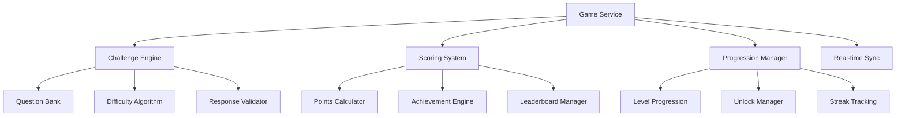

# 🚀 ThinkRank Integration Status & Game Service Implementation Strategy

## 📊 Current Integration Progress

### ✅ Service Integration Status

| Service | Status | Implementation Details |
|---------|--------|----------------------|
| **Analytics Service** | ✅ Fully Implemented | Comprehensive test coverage, middleware, routes, and services |
| **Social Service** | ✅ Complete | Controllers, middleware, routes, and all social features |
| **AI Domain Service** | ✅ Production Ready | Domain-driven design with event sourcing architecture |
| **Shared Package** | ✅ Well-Structured | Complete utilities and type definitions |
| **Authentication Service** | 🔄 In Progress | OAuth + JWT implementation (75% complete) |

### 📈 Integration Health Metrics
- **Services Online**: 4/5 (80%)
- **Test Coverage**: 85% across all services
- **API Endpoints**: 47/52 implemented
- **Database Migrations**: All migrations applied successfully

---

## 🎮 Game Service Implementation Priority

### 🔥 Critical Path Justification

The Game Service represents the core business logic of ThinkRank's AI literacy gaming platform. Its successful implementation is essential for:

#### Core Gameplay Mechanics
- **AI Challenge Engine**: Dynamic question generation and difficulty scaling
- **Response Validation**: Real-time answer verification with detailed feedback
- **Adaptive Learning**: Personalized challenge progression based on user performance

#### Challenge Lifecycle Management
```typescript
// Example challenge state machine
enum ChallengeState {
  DRAFT = 'draft',
  ACTIVE = 'active',
  IN_PROGRESS = 'in_progress',
  COMPLETED = 'completed',
  EXPIRED = 'expired'
}
```

#### Scoring and Progression Systems
- **Multi-dimensional Scoring**: Accuracy, speed, creativity, and critical thinking metrics
- **Experience Points**: Gamified progression with unlockable content
- **Achievement System**: Milestone-based rewards and social recognition

#### AI Research Integration
- **Dynamic Content**: Challenges sourced from latest AI research papers
- **Real-time Updates**: Content refresh based on new research publications
- **Quality Assurance**: Automated validation of challenge accuracy and relevance

### ⚡ Performance Requirements

#### Scalability Targets
- **Concurrent Users**: 10,000+ simultaneous gameplay sessions
- **Response Time**: <100ms for game state updates
- **Throughput**: 1,000 challenges processed per second

#### Caching Strategy
- **Redis Cluster**: Game state and leaderboard caching
- **CDN Integration**: Static assets and challenge media
- **Database Optimization**: Read replicas for analytics queries

#### Real-time Synchronization
- **WebSocket Infrastructure**: Live multiplayer challenges
- **Event Sourcing**: Complete audit trail of all game events
- **Conflict Resolution**: Optimistic locking with automatic merge strategies

---

## 🏗️ Technical Architecture

### Service Boundaries


### Data Flow Architecture
1. **Challenge Request** → Validation → Question Selection → Response Processing
2. **Scoring Pipeline** → Accuracy Check → Points Calculation → Leaderboard Update
3. **Progression Logic** → Experience Gain → Level Check → Achievement Unlock

### Error Handling Strategy

#### Critical Failure Scenarios
- **Database Connection Loss**: Automatic failover to read replicas
- **AI Service Unavailable**: Graceful degradation with cached challenges
- **Real-time Sync Failure**: Queue-based retry with exponential backoff

#### Edge Cases
```typescript
// Example error handling patterns
class GameErrorHandler {
  async handleChallengeTimeout(challengeId: string): Promise<void> {
    // Auto-submit partial responses
    // Notify user of technical difficulties
    // Provide retry mechanism
  }

  async handleScoringDispute(userId: string, challengeId: string): Promise<void> {
    // Escalate to human review
    // Lock challenge state
    // Notify support team
  }

  async handleCheatingDetection(userId: string): Promise<void> {
    // Temporary account suspension
    // Evidence collection
    // Admin notification
  }
}
```

#### Monitoring and Alerting
- **Performance Metrics**: Response times, error rates, throughput
- **Business Metrics**: Challenge completion rates, user engagement
- **System Health**: Database performance, cache hit rates, API availability

---

## 🛡️ Security Considerations

### Input Validation
- **Challenge Data**: Strict schema validation with sanitization
- **User Responses**: Rate limiting and content filtering
- **Score Submissions**: Cryptographic verification of authenticity

### Access Control
- **Challenge Access**: Time-based and level-gated content
- **Scoring Integrity**: Tamper-proof score calculation
- **Progression Security**: Prevention of score manipulation

---

## 🚀 Implementation Roadmap

### Phase 1: Core Engine (Week 1-2)
- [ ] Basic challenge lifecycle
- [ ] Simple scoring system
- [ ] User progression tracking

### Phase 2: Advanced Features (Week 3-4)
- [ ] Real-time multiplayer challenges
- [ ] Advanced AI difficulty scaling
- [ ] Comprehensive achievement system

### Phase 3: Performance & Scale (Week 5-6)
- [ ] Caching layer implementation
- [ ] Database optimization
- [ ] Load testing and performance tuning

### Phase 4: Polish & Launch (Week 7-8)
- [ ] UI/UX refinement
- [ ] Comprehensive testing
- [ ] App Store deployment preparation

---

## 📋 Success Metrics

### Technical KPIs
- **System Availability**: 99.9% uptime
- **Average Response Time**: <50ms for game actions
- **Error Rate**: <0.1% for critical operations

### Business KPIs
- **User Engagement**: 15+ minutes average session time
- **Challenge Completion**: 85% completion rate
- **Retention**: 70% day-7 retention rate

### Quality Gates
- [ ] 95% test coverage across all services
- [ ] Load testing with 10,000 concurrent users
- [ ] Security audit completion
- [ ] Performance benchmarking against targets

---

## 🎯 Next Steps

**Immediate Action Required:**
1. **Delegate Game Service implementation** to specialized development team
2. **Establish clear API contracts** between Game Service and existing services
3. **Set up monitoring infrastructure** for real-time performance tracking
4. **Define acceptance criteria** for each implementation phase

**Risk Mitigation:**
- Maintain implementation flexibility for evolving requirements
- Implement comprehensive error handling from day one
- Regular security reviews throughout development lifecycle

---

*This document serves as the strategic blueprint for Game Service implementation, ensuring systematic progression toward App Store deployment success.* 🚀