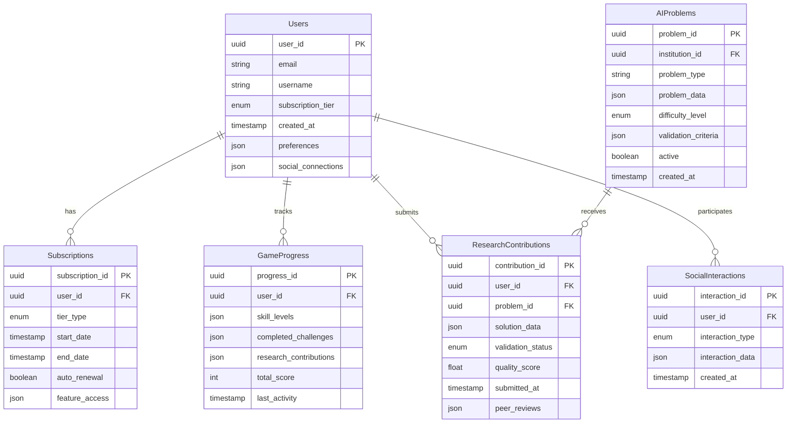
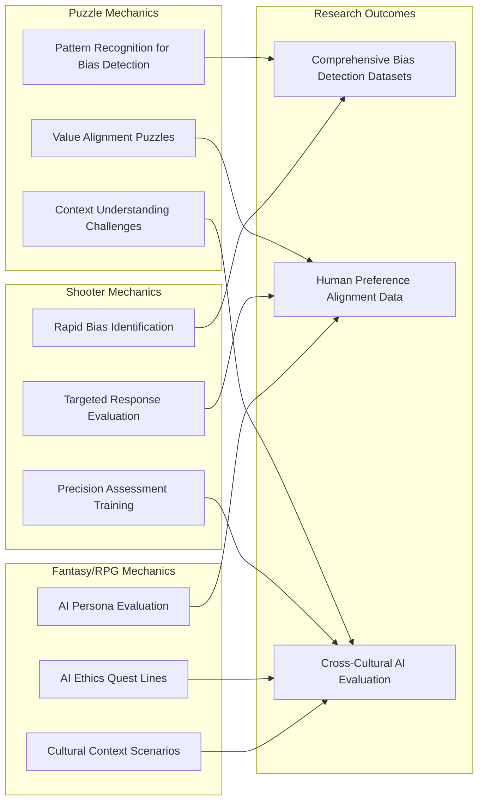

# ThinkRank: Foundational Architecture & Comprehensive Implementation Plan

## Executive Summary

ThinkRank is a hybrid gaming-educational mobile platform that combines engaging game mechanics (puzzle, shooter, fantasy) with generative AI education and research contribution. Inspired by the successful Phylo McGill model, ThinkRank addresses critical challenges in generative AI research through citizen science while providing players with comprehensive AI literacy education.

**Key Performance Targets:**
- 60fps performance across iOS/Android platforms
- Sub-200ms feedback response time
- Three-tier monetization model with strategic research integration
- 20-hour/week solo development timeline

---

## Project Analysis

### Current State Assessment
- **Starting Point**: Greenfield project with empty implementation plan
- **Research Foundation**: Comprehensive analysis of Phylo McGill's citizen science approach and current generative AI research challenges
- **Target Market**: AI-curious gamers, educational institutions, research communities
- **Platform Strategy**: Cross-platform mobile-first with potential web expansion

### Critical Gaps Identified
1. **Technical Performance**: Need for optimized mobile architecture achieving 60fps/sub-200ms targets
2. **Research Integration**: Systematic approach to converting AI research problems into engaging game mechanics
3. **Educational Framework**: Progressive learning system tied to actual research contribution
4. **Social Validation**: Community-driven validation of research contributions
5. **Monetization Balance**: Revenue model that supports both engagement and research integrity

---

## Technical Architecture Foundation

### High-Level System Architecture

```mermaid
graph TB
    subgraph "Client Layer"
        UE5[Unreal Engine 5 Mobile Client]
        iOS[iOS Native Components]
        Android[Android Native Components]
        GameUI[Responsive Game Interface]
        AILearningUI[AI Learning Interface]
        SocialUI[Social Competition Interface]
    end
    
    subgraph "Performance Optimization Layer"
        RenderPipeline[60fps Rendering Pipeline]
        InputSystem[Sub-200ms Input Processing]
        AssetStreaming[Dynamic Asset Streaming]
        MemoryManager[Optimized Memory Management]
        BatteryOptimizer[Battery Usage Optimization]
    end
    
    subgraph "API Gateway & Services"
        APIGateway[REST/GraphQL API Gateway]
        AuthService[JWT Authentication Service]
        GameLogicService[Game State Management]
        AIResearchService[AI Problem Distribution]
        SocialService[Social Media Integration]
        AnalyticsService[Performance & Usage Analytics]
        NotificationService[Push Notification System]
    end
    
    subgraph "AI Research Platform"
        ResearchPortal[Research Institution Portal]
        ProblemGenerator[Dynamic AI Problem Generator]
        ValidationEngine[Multi-tier Validation System]
        BiasDetectionEngine[Real-time Bias Analysis]
        AlignmentTracker[Human-AI Alignment Metrics]
        ContributionTracker[Research Impact Tracking]
    end
    
    subgraph "Data Architecture"
        UserDB[(User Profiles & Preferences)]
        GameStateDB[(Game Progress & Achievements)]
        AIProblemsDB[(Research Problems Database)]
        ContributionsDB[(Player Research Contributions)]
        SocialDB[(Social Interactions & Rankings)]
        AnalyticsDB[(Performance & Usage Data)]
        CDN[Global Content Delivery Network]
    end
    
    subgraph "External Integrations"
        SocialAPIs[Social Media APIs]
        PaymentGateways[Payment Processing]
        AdNetworks[Strategic Ad Networks]
        ResearchInstitutions[Partner Research Institutions]
        AIModels[External AI Model APIs]
    end
    
    UE5 --> Performance Optimization Layer
    Performance Optimization Layer --> API Gateway & Services
    API Gateway & Services --> AI Research Platform
    API Gateway & Services --> Data Architecture
    API Gateway & Services --> External Integrations
```

### Backend Infrastructure Requirements

**Scalability Architecture:**
- **Microservices**: Independent scaling of game logic, AI research, and social features
- **Container Orchestration**: Kubernetes for automated scaling and deployment
- **Database Strategy**: 
  - PostgreSQL for transactional data (user profiles, game state)
  - MongoDB for research contributions and AI problem datasets
  - Redis for real-time features and caching
- **CDN Strategy**: Global content delivery for game assets and AI training data

**Performance Requirements:**
- **Response Time**: <200ms for all user interactions
- **Throughput**: Support for 100,000+ concurrent players
- **Availability**: 99.9% uptime with automated failover
- **Data Consistency**: Strong consistency for research contributions, eventual consistency for social features

### Database Architecture Supporting Three-Tier Monetization



### Performance Architecture for 60fps/Sub-200ms Targets

**Client-Side Optimization:**
- **Rendering Pipeline**: Optimized UE5 mobile rendering with dynamic LOD
- **Asset Management**: Smart prefetching and background loading
- **Input Processing**: Dedicated input thread with predictive processing
- **Memory Management**: Object pooling and garbage collection optimization

**Network Optimization:**
- **Protocol**: Custom UDP protocol for real-time interactions, HTTPS for research data
- **Compression**: Advanced compression for AI problem datasets
- **Caching Strategy**: Multi-level caching (device, edge, origin)
- **Predictive Loading**: AI-powered prediction of user actions for preloading

**AI Research Integration Performance:**
- **Problem Distribution**: Intelligent load balancing based on player skill and device capabilities
- **Solution Processing**: Asynchronous processing with real-time feedback
- **Validation Pipeline**: Parallel validation with early feedback mechanisms

---

## Refined AI Education Integration Model

### Specific Generative AI Research Challenges

**1. Bias Detection & Mitigation**
- **Position Bias**: Players identify when AI evaluators favor specific response positions
- **Verbosity Bias**: Recognition of unwarranted preference for longer responses
- **Cultural Bias**: Detection of cultural insensitivity in AI-generated content
- **Gender/Demographic Bias**: Identification of stereotyping in AI outputs

**2. Human-AI Alignment**
- **Value Alignment**: Ranking AI responses based on human values and preferences
- **Ethical Decision Making**: Evaluation of AI choices in moral dilemma scenarios
- **Helpfulness Assessment**: Rating AI assistance quality across diverse contexts
- **Safety Evaluation**: Identifying potentially harmful or misleading AI responses

**3. Dynamic Context Evaluation**
- **Context Sensitivity**: Assessing AI's understanding of situational nuances
- **Cultural Context**: Evaluating AI responses across different cultural frameworks
- **Temporal Context**: Testing AI's awareness of time-sensitive information
- **Domain Adaptation**: Evaluation of AI performance across specialized domains

### Game Mechanics Mapped to Research Objectives



### Educational Progression Framework

**Level 1: AI Fundamentals (Free Tier)**
- Basic understanding of how AI generates text and images
- Introduction to common AI biases through interactive examples
- Simple pattern recognition games for bias detection
- Educational ads focusing on AI ethics and responsible use

**Level 2: Bias Recognition (Premium Tier)**
- Advanced bias detection across multiple AI output types
- Cultural sensitivity challenges with diverse perspectives
- Social sharing of learning achievements and research contributions
- Ad-free gameplay with educational content in documentation

**Level 3: Research Contribution (Premium/Pro Tier)**
- Direct contribution to active research problems
- Collaboration with research institutions on validation
- Advanced alignment evaluation tasks
- Access to cutting-edge research problems

**Level 4: AI Development Input (Pro Tier Only)**
- Voting on research priorities and feature development
- Early access to experimental AI research problems
- Direct feedback to AI model developers
- Potential co-authorship on research publications

---

## Implementation Phase Structure

### Phase 1: Foundation (Weeks 1-7, 140 hours)

**Week 1-2: Project Setup & Architecture (40 hours)**
- Development environment setup (UE5, mobile SDKs, backend infrastructure)
- CI/CD pipeline establishment
- Database schema implementation
- Basic API framework development

**Week 3-4: UE5 Project Template (40 hours)**
- Mobile-optimized UE5 project creation
- Performance baseline establishment
- Basic UI framework implementation
- Cross-platform build system setup

**Week 5-7: Core Game Framework (60 hours)**
- Game state management system
- User authentication and profile system
- Basic navigation and menu systems
- Performance monitoring implementation

### Phase 2: Core Systems (Weeks 8-13, 120 hours)

**Week 8-9: Performance Optimization (40 hours)**
- 60fps rendering pipeline optimization
- Sub-200ms input system implementation
- Memory management and garbage collection tuning
- Battery usage optimization

**Week 10-11: Authentication & User Management (40 hours)**
- JWT-based authentication system
- User profile management
- Subscription tier implementation
- Social media account linking

**Week 12-13: Database Architecture (40 hours)**
- Production database deployment
- Data migration and backup systems
- Analytics and monitoring setup
- Performance optimization and indexing

### Phase 3: Game Mechanics (Weeks 14-21, 160 hours)

**Week 14-16: Puzzle System Development (60 hours)**
- Bias detection puzzle framework
- Pattern recognition game mechanics
- Progressive difficulty system
- Scoring and feedback mechanisms

**Week 17-19: AI Problem Integration (60 hours)**
- Research problem distribution system
- AI output evaluation interface
- Solution validation pipeline
- Research institution portal

**Week 20-21: Scoring & Progression (40 hours)**
- Player progression tracking
- Achievement and badge system
- Leaderboard implementation
- Research contribution metrics

### Phase 4: Social & Monetization (Weeks 22-26, 100 hours)

**Week 22-23: Social Media Integration (40 hours)**
- Facebook, Instagram, X, TikTok API integration
- Social sharing functionality
- Competition and ranking systems
- Community features implementation

**Week 24-25: Monetization Implementation (40 hours)**
- Three-tier subscription system
- In-app purchase integration
- Payment processing and security
- Feature access control

**Week 26: Ad Integration (20 hours)**
- Strategic ad placement for Free tier
- Ad-free experience for Premium/Pro tiers
- Educational ad content curation
- Revenue tracking and optimization

### Phase 5: Polish & Launch (Weeks 27-31, 100 hours)

**Week 27-29: Beta Testing & Optimization (60 hours)**
- Internal testing and bug fixes
- Performance optimization based on testing
- User feedback integration
- Security audit and compliance

**Week 30: App Store Submission (20 hours)**
- iOS App Store submission and review
- Google Play Store submission and review
- Marketing materials and app store optimization
- Compliance documentation

**Week 31: Launch Preparation (20 hours)**
- Production deployment
- Monitoring and alerting setup
- Customer support system
- Launch marketing campaign

### Critical Path Analysis

**Critical Dependencies:**
1. **Performance Foundation → Game Mechanics**: 60fps/sub-200ms requirements must be met before implementing complex game logic
2. **Authentication System → Social Features**: User management must be stable before social media integration
3. **AI Problem Framework → Research Integration**: Core problem distribution system required before research partnerships
4. **Monetization Framework → App Store Approval**: Payment processing must be secure and compliant

**Risk Mitigation:**
- **Technical Risks**: Early performance prototyping and continuous testing
- **Integration Risks**: Parallel development of social media integration with fallback options
- **Scope Risks**: Modular development allowing for feature postponement without core impact
- **Timeline Risks**: 20% buffer built into each phase for unexpected challenges

---

## Technical Specification Framework

### API Design Principles

**RESTful Architecture with GraphQL Enhancement:**
```
Base URL: https://api.thinkrank.com/v1/

Authentication:
- JWT Bearer tokens with 15-minute access tokens
- Refresh tokens with 30-day expiration
- Rate limiting: 1000 requests/hour per user

Core Endpoints:
- /auth/* - Authentication and user management
- /game/* - Game state and progress
- /research/* - AI problem distribution and solutions
- /social/* - Social features and sharing
- /analytics/* - Performance and usage tracking
```

**GraphQL Schema for Complex Queries:**
```graphql
type User {
  id: ID!
  username: String!
  tier: SubscriptionTier!
  gameProgress: GameProgress!
  researchContributions: [ResearchContribution!]!
  socialConnections: [SocialConnection!]!
}

type AIResearchProblem {
  id: ID!
  type: ProblemType!
  difficulty: DifficultyLevel!
  data: JSON!
  validationCriteria: JSON!
  contributors: [User!]!
}
```

### Mobile Performance Optimization Strategies

**Rendering Optimization:**
- **Level-of-Detail (LOD) System**: Automatic quality adjustment based on device capabilities
- **Occlusion Culling**: Advanced frustum and occlusion culling for complex scenes
- **Texture Streaming**: Dynamic texture resolution based on viewing distance and device memory
- **Shader Optimization**: Platform-specific shader compilation and optimization

**Memory Management:**
- **Object Pooling**: Pre-allocated pools for frequently created/destroyed objects
- **Garbage Collection Tuning**: Optimized GC settings for mobile platforms
- **Asset Bundling**: Smart asset bundling with dependency management
- **Background Loading**: Asynchronous asset loading with priority queuing

**Network Optimization:**
- **Request Batching**: Combining multiple API calls into single requests
- **Data Compression**: GZIP compression for all API responses
- **Caching Strategy**: Multi-level caching (device → edge → origin)
- **Offline Mode**: Local storage for offline gameplay and sync upon reconnection

### Cross-Platform Compatibility Requirements

**iOS-Specific Considerations:**
- iOS 13+ support for maximum device coverage
- Metal rendering optimization for Apple hardware
- App Store Review Guidelines compliance
- TestFlight beta testing integration

**Android-Specific Considerations:**
- Android API level 23+ (Android 6.0+) support
- Vulkan API optimization for supported devices
- Google Play Console optimization
- Android App Bundle implementation for reduced download sizes

**Shared Requirements:**
- Responsive UI scaling for various screen sizes and densities
- Platform-specific social media SDK integration
- Native platform notification systems
- Platform-appropriate monetization implementations

### Security and Data Privacy Considerations

**Data Protection Framework:**
- **GDPR Compliance**: Explicit consent mechanisms and data portability
- **CCPA Compliance**: California privacy rights implementation
- **Data Minimization**: Collection of only essential user data
- **Encryption**: End-to-end encryption for sensitive research contributions

**Authentication Security:**
- **OAuth 2.0**: Secure social media authentication
- **Multi-Factor Authentication**: Optional 2FA for enhanced security
- **Session Management**: Secure session handling with automatic timeout
- **Password Security**: Industry-standard hashing and salt implementation

**Research Data Protection:**
- **Anonymization**: Automatic PII removal from research contributions
- **Access Controls**: Role-based access for research institution partners
- **Audit Logging**: Comprehensive logging of data access and modifications
- **Data Retention**: Clear policies for research data lifecycle management

---

## Monetization Strategy Integration

### Three-Tier Model Implementation

**Free Tier - AI Explorer:**
- **Game Access**: Basic puzzle and pattern recognition games
- **AI Education**: Fundamental AI literacy content with interactive tutorials
- **Research Participation**: Entry-level bias detection tasks
- **Ad Integration**: Educational ads about AI ethics, research, and technology
- **Social Features**: Basic leaderboards and achievement sharing
- **Limitations**: 3 research problems per day, standard game assets

**Premium Tier - AI Investigator ($9.99/month):**
- **Enhanced Gameplay**: Advanced puzzle mechanics and shooter-style challenges
- **Ad-Free Gaming**: No ads during gameplay, educational content in documentation only
- **Social Media Integration**: Full sharing capabilities across all platforms
- **Research Access**: Unlimited daily research problems, intermediate difficulty
- **Progress Tracking**: Detailed analytics and learning progress reports
- **Community Features**: Access to researcher forums and community challenges

**Pro Tier - AI Researcher ($29.99/month):**
- **Complete Access**: All content and features without restrictions
- **Research Influence**: Voting rights on platform development and research priorities
- **Early Access**: Beta testing for new features and cutting-edge research problems
- **Publication Credits**: Potential co-authorship on research papers for significant contributions
- **Direct Researcher Contact**: Communication channels with partner research institutions
- **Custom Challenges**: Ability to request specific research problems or educational content

### Revenue Model Projections

**Year 1 Targets:**
- 10,000 active free users (base engagement)
- 1,000 Premium subscribers (10% conversion rate)
- 100 Pro subscribers (1% conversion rate)
- Monthly recurring revenue: $13,000

**Scaling Strategy:**
- Educational institution partnerships for bulk licensing
- Corporate training programs for AI literacy
- Research institution subscriptions for access to aggregated insights
- Gamification consulting for other educational platforms

---

## Success Metrics and Validation Framework

### Performance Metrics

**Technical Performance:**
- **Frame Rate**: Consistent 60fps on target devices (95th percentile)
- **Response Time**: <200ms for all user interactions (99th percentile)
- **Crash Rate**: <0.1% crash rate across all platforms
- **Load Time**: <3 seconds for app startup, <1 second for game transitions

**User Engagement:**
- **Daily Active Users (DAU)**: Target 70% of Monthly Active Users
- **Session Length**: Average 15-20 minutes per gaming session
- **Retention Rate**: 40% Day-7 retention, 20% Day-30 retention
- **Progression Rate**: 60% of users completing tutorial, 30% reaching intermediate levels

### Educational Impact Validation

**Learning Outcome Assessment:**
- **Pre/Post Knowledge Tests**: Validated AI literacy assessments
- **Skill Progression Tracking**: Measurable improvement in bias detection accuracy
- **Concept Application**: Transfer of learning to novel AI evaluation scenarios
- **Long-term Retention**: Follow-up assessments at 30, 60, and 90 days

**Research Contribution Quality:**
- **Validation Accuracy**: Player solutions validated against expert evaluations
- **Research Institution Feedback**: Direct feedback from partner researchers
- **Publication Impact**: Tracking of research papers citing platform contributions
- **Bias Detection Improvement**: Measurable improvement in AI bias detection capabilities

### Social and Community Metrics

**Social Engagement:**
- **Sharing Rate**: 15% of achievements shared on social media
- **Community Participation**: 25% of users engaging in forums or discussions
- **Peer Learning**: Evidence of users teaching and helping each other
- **Research Collaboration**: Formation of user groups tackling complex problems

**Research Institution Partnerships:**
- **Active Partnerships**: Target 5 research institutions in Year 1
- **Problem Upload Rate**: 10 new research problems per month
- **Solution Quality**: 80% of solutions meeting research-grade validation criteria
- **Research Output**: Contribution to at least 2 peer-reviewed publications in Year 1

---

## Risk Assessment and Mitigation Strategies

### Technical Risks

**Performance Risks:**
- **Risk**: Inability to achieve 60fps/sub-200ms targets on lower-end devices
- **Mitigation**: Extensive early testing, adaptive quality settings, progressive enhancement approach
- **Contingency**: Tiered performance modes with graceful degradation

**Integration Risks:**
- **Risk**: Social media API changes or restrictions
- **Mitigation**: Multi-platform integration, fallback sharing mechanisms, direct platform negotiations
- **Contingency**: Native sharing alternatives, reduced social features if necessary

**Scalability Risks:**
- **Risk**: Backend performance degradation with user growth
- **Mitigation**: Microservices architecture, automated scaling, comprehensive monitoring
- **Contingency**: Cloud provider migration capabilities, horizontal scaling implementation

### Business and Market Risks

**Competition Risks:**
- **Risk**: Major educational technology companies entering AI gaming space
- **Mitigation**: Strong research partnerships, unique citizen science angle, first-mover advantage
- **Contingency**: Pivot to B2B research tools, specialized niche focus

**Research Partnership Risks:**
- **Risk**: Difficulty securing research institution partnerships
- **Mitigation**: Early outreach, proof-of-concept demonstrations, flexible partnership terms
- **Contingency**: Synthetic research problems, academic collaboration through publications

**Monetization Risks:**
- **Risk**: Lower than expected conversion rates from free to paid tiers
- **Mitigation**: A/B testing of tier features, user feedback integration, value proposition refinement
- **Contingency**: Advertising revenue focus, alternative monetization models

### Regulatory and Compliance Risks

**Data Privacy Risks:**
- **Risk**: Changing privacy regulations affecting data collection
- **Mitigation**: Privacy-by-design implementation, minimal data collection, compliance monitoring
- **Contingency**: Geographic restrictions, reduced data collection capabilities

**App Store Risks:**
- **Risk**: App store policy changes affecting distribution
- **Mitigation**: Policy compliance monitoring, direct distribution alternatives, web app development
- **Contingency**: Progressive web app deployment, direct download distribution

---

## Research Institution Partnership Strategy

### Partnership Framework

**Tier 1 Partnerships - Full Integration:**
- Joint research project development
- Shared publication opportunities
- Direct researcher access to platform data
- Custom problem development for specific research needs

**Tier 2 Partnerships - Problem Contribution:**
- Research problem upload and validation
- Access to aggregated solution data
- Platform feature influence based on research needs
- Regular feedback and validation sessions

**Tier 3 Partnerships - Educational Collaboration:**
- Curriculum integration opportunities
- Student project collaboration
- Educational content development
- Platform access for educational purposes

### Target Research Institutions

**Primary Targets:**
- Stanford AI Lab (HAI) - Human-Centered AI research
- MIT CSAIL - Computer Science and Artificial Intelligence Laboratory
- Google AI - Ethics and fairness research teams
- OpenAI - Alignment and safety research
- Anthropic - Constitutional AI research

**Secondary Targets:**
- University research labs focusing on bias detection
- International AI ethics research centers
- Government AI research initiatives
- Corporate AI research divisions

---

## Future Development Roadmap

### Year 1: Foundation and Launch
- Core platform development and launch
- Initial research partnerships establishment
- Basic AI education curriculum implementation
- Performance optimization and user feedback integration

### Year 2: Expansion and Enhancement
- Advanced game mechanics (VR/AR integration)
- Expanded research problem types
- International market expansion
- Educational institution partnership program

### Year 3: Platform Evolution
- AI-powered personalized learning paths
- Advanced research collaboration tools
- Corporate training program launch
- Open-source component development

### Long-term Vision (Years 4-5)
- Industry-standard platform for AI education
- Major research publications citing platform contributions
- Global network of educational and research partnerships
- Expansion into other AI research domains (robotics, healthcare AI, etc.)

---

## Conclusion

ThinkRank represents a unique opportunity to address critical challenges in generative AI research while providing engaging, educational gaming experiences. By combining the proven citizen science model of Phylo McGill with cutting-edge mobile game development and current AI research needs, the platform can make significant contributions to both AI education and scientific advancement.

The comprehensive architecture outlined in this plan provides a solid foundation for systematic development, ensuring performance targets are met while maintaining the integrity of both educational content and research contributions. The phased development approach allows for continuous validation and adjustment, while the clear technical specifications provide guidance for implementation teams.

Success will be measured not only through traditional gaming metrics but also through meaningful contributions to AI research and demonstrated improvements in AI literacy among users. This dual-purpose approach positions ThinkRank as both a commercial venture and a valuable tool for advancing human understanding of artificial intelligence.

---

*This document serves as the foundational architecture and implementation blueprint for ThinkRank development. Regular updates and refinements should be made based on user feedback, research partnership developments, and technological advances in both gaming and AI research domains.*