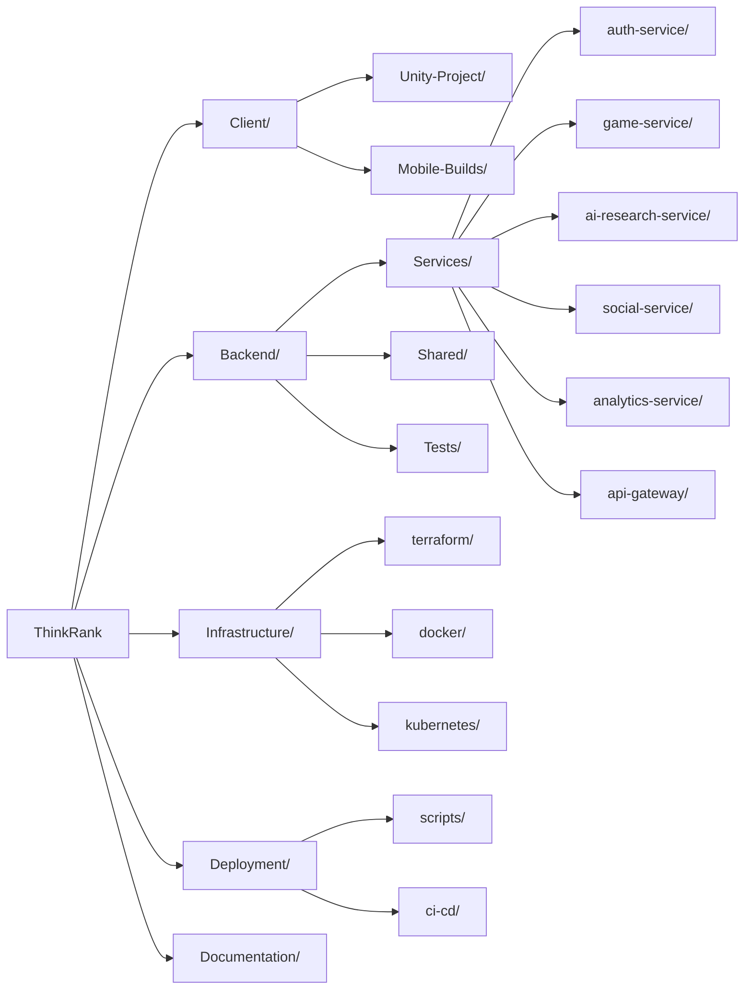
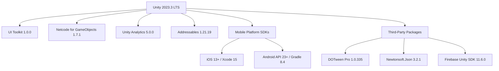
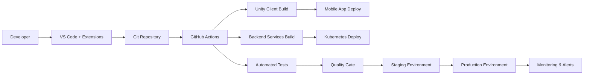
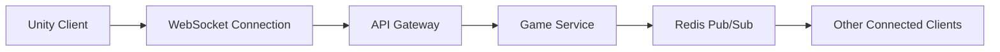
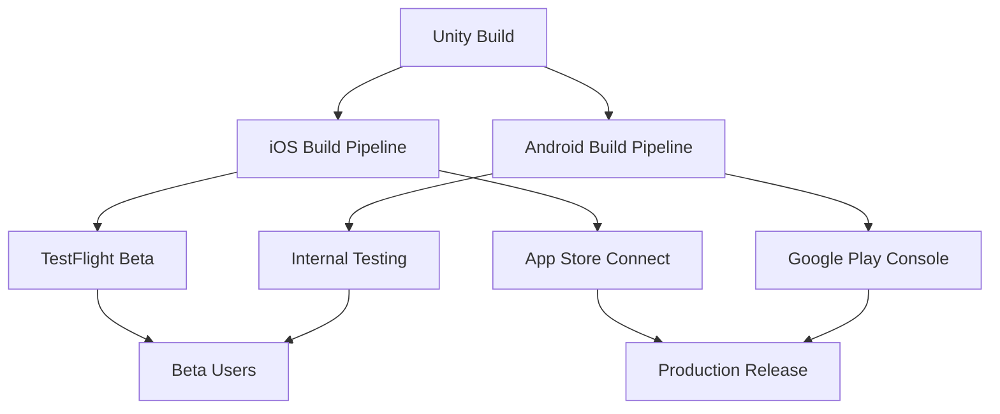
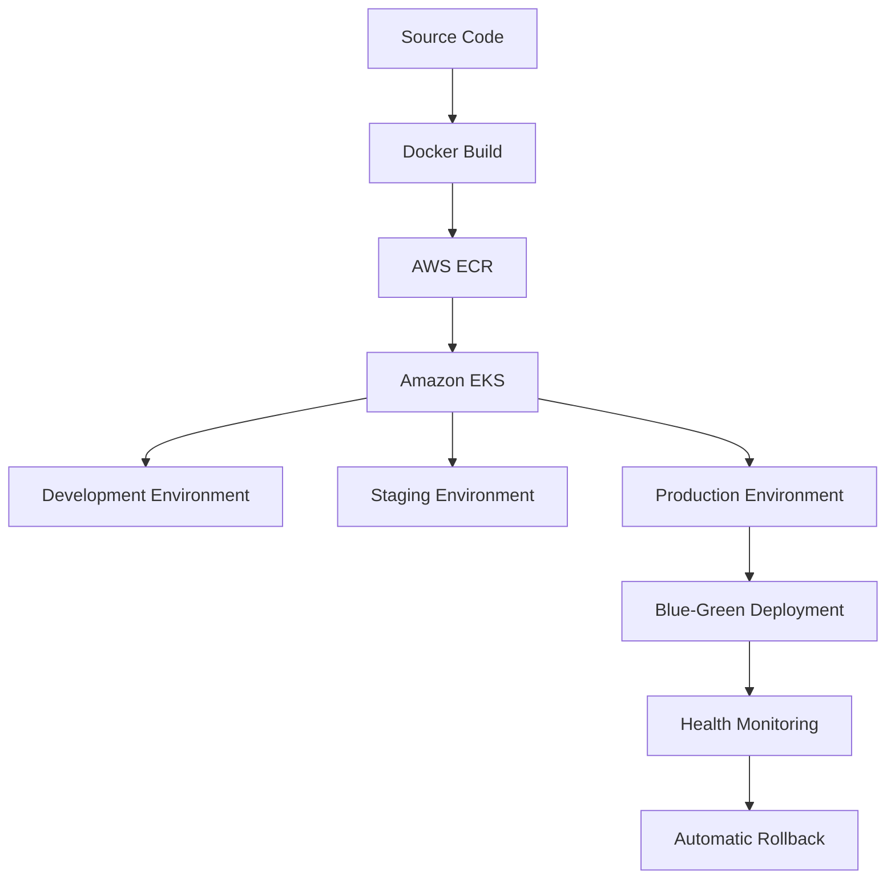
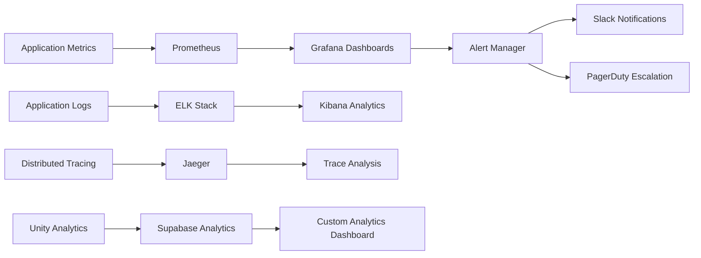
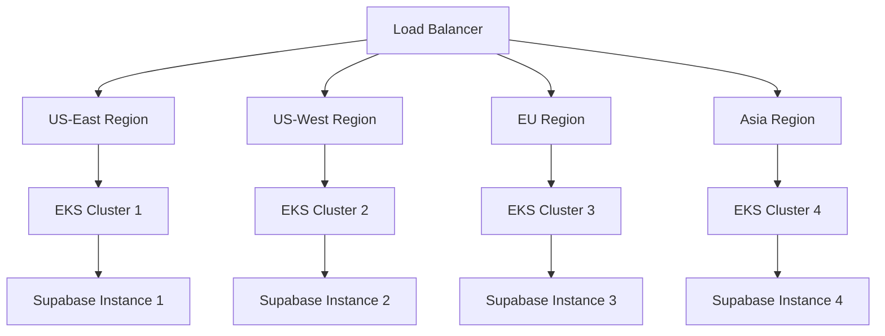

# ThinkRank: Technical Architecture & Project Structure Design

## Executive Summary

ThinkRank is a hybrid gaming-educational mobile platform that combines engaging game mechanics with generative AI education and research contribution. This document outlines the comprehensive technical architecture, project structure, and development framework optimized for solo development using Unity, AWS cloud infrastructure, and modern development practices.

**Key Performance Targets:**
- 60fps performance across iOS/Android platforms
- Sub-200ms feedback response time
- Scalable microservices architecture
- Cross-platform mobile deployment

---

## System Architecture Overview

```mermaid
graph TB
    subgraph "Mobile Client Layer"
        Unity[Unity 2023.3 LTS Mobile Client]
        iOS[iOS Platform Integration]
        Android[Android Platform Integration]
        UI[Unity UI Toolkit Interface]
        Networking[Unity Netcode for GameObjects]
    end
    
    subgraph "AWS Cloud Infrastructure"
        ALB[Application Load Balancer]
        EKS[Amazon EKS Cluster]
        RDS[Amazon RDS PostgreSQL]
        Supabase[Supabase Backend-as-a-Service]
        ElastiCache[Amazon ElastiCache Redis]
        S3[Amazon S3 Asset Storage]
        CloudFront[CloudFront CDN]
    end
    
    subgraph "Backend Microservices"
        AuthService[Authentication Service]
        GameService[Game Logic Service]
        AIService[AI Research Service]
        SocialService[Social Integration Service]
        AnalyticsService[Analytics Service]
        NotificationService[Push Notification Service]
    end
    
    subgraph "External Integrations"
        SocialAPIs[Social Media APIs]
        PaymentGateways[Payment Processing]
        ResearchInstitutions[Research Institution APIs]
        MobileNotifications[FCM/APNS]
    end
    
    Unity --> ALB
    ALB --> EKS
    EKS --> AuthService
    EKS --> GameService
    EKS --> AIService
    EKS --> SocialService
    EKS --> AnalyticsService
    EKS --> NotificationService
    
    AuthService --> RDS
    GameService --> RDS
    AIService --> Supabase
    SocialService --> ElastiCache
    AnalyticsService --> Supabase
    
    GameService --> S3
    Unity --> CloudFront
    CloudFront --> S3
    
    SocialService --> SocialAPIs
    AuthService --> PaymentGateways
    AIService --> ResearchInstitutions
    NotificationService --> MobileNotifications
```



## Project Directory Structure



### Detailed Directory Structure

```
thinkrank/
├── client/
│   ├── unity-project/
│   │   ├── Assets/
│   │   │   ├── Scripts/
│   │   │   │   ├── Core/
│   │   │   │   │   ├── GameManager.cs
│   │   │   │   │   ├── NetworkManager.cs
│   │   │   │   │   ├── SceneManager.cs
│   │   │   │   │   └── PerformanceManager.cs
│   │   │   │   ├── UI/
│   │   │   │   │   ├── MainMenu/
│   │   │   │   │   ├── GameplayUI/
│   │   │   │   │   ├── SocialUI/
│   │   │   │   │   └── SettingsUI/
│   │   │   │   ├── Gameplay/
│   │   │   │   │   ├── PuzzleSystem/
│   │   │   │   │   ├── BiasDetection/
│   │   │   │   │   ├── ScoreSystem/
│   │   │   │   │   └── ProgressionSystem/
│   │   │   │   ├── AI/
│   │   │   │   │   ├── ProblemRenderer.cs
│   │   │   │   │   ├── SolutionValidator.cs
│   │   │   │   │   └── ResearchContribution.cs
│   │   │   │   ├── Social/
│   │   │   │   │   ├── SocialMediaIntegration.cs
│   │   │   │   │   ├── Leaderboards.cs
│   │   │   │   │   └── AchievementSystem.cs
│   │   │   │   └── Utils/
│   │   │   │       ├── APIClient.cs
│   │   │   │       ├── DataPersistence.cs
│   │   │   │       └── PerformanceProfiler.cs
│   │   │   ├── Prefabs/
│   │   │   ├── Materials/
│   │   │   ├── Textures/
│   │   │   ├── Audio/
│   │   │   ├── Scenes/
│   │   │   └── StreamingAssets/
│   │   ├── Packages/
│   │   ├── ProjectSettings/
│   │   └── UserSettings/
│   ├── mobile-builds/
│   │   ├── ios/
│   │   └── android/
│   └── build-scripts/
│       ├── build-ios.sh
│       ├── build-android.sh
│       └── deploy-mobile.sh
├── backend/
│   ├── services/
│   │   ├── auth-service/
│   │   │   ├── src/
│   │   │   │   ├── controllers/
│   │   │   │   ├── services/
│   │   │   │   ├── models/
│   │   │   │   ├── middleware/
│   │   │   │   └── routes/
│   │   │   ├── tests/
│   │   │   ├── Dockerfile
│   │   │   ├── package.json
│   │   │   └── README.md
│   │   ├── game-service/
│   │   ├── ai-research-service/
│   │   ├── social-service/
│   │   ├── analytics-service/
│   │   └── api-gateway/
│   ├── shared/
│   │   ├── models/
│   │   ├── utils/
│   │   ├── config/
│   │   └── types/
│   └── tests/
│       ├── integration/
│       └── performance/
├── infrastructure/
│   ├── terraform/
│   │   ├── modules/
│   │   │   ├── eks/
│   │   │   ├── rds/
│   │   │   ├── redis/
│   │   │   └── s3/
│   │   ├── environments/
│   │   │   ├── dev/
│   │   │   ├── staging/
│   │   │   └── production/
│   │   └── main.tf
│   ├── docker/
│   │   ├── base-images/
│   │   └── docker-compose.yml
│   └── kubernetes/
│       ├── base/
│       ├── overlays/
│       │   ├── dev/
│       │   ├── staging/
│       │   └── production/
│       └── helm-charts/
├── deployment/
│   ├── ci-cd/
│   │   ├── github-actions/
│   │   ├── jenkins/
│   │   └── scripts/
│   └── monitoring/
│       ├── prometheus/
│       ├── grafana/
│       └── elk-stack/
├── documentation/
│   ├── architecture/
│   ├── api-specs/
│   ├── development-guides/
│   └── deployment-guides/
└── tools/
    ├── code-generation/
    ├── testing/
    └── performance/
```

## Technology Stack Specifications

### Client Technology Stack


### Backend Technology Stack

```mermaid
graph TD
    Node[Node.js 20.10 LTS] --> Express[Express.js 4.18.2]
    Node --> TypeScript[TypeScript 5.3.2]
    Node --> Prisma[Prisma ORM 5.7.1]
    
    Databases --> PostgreSQL[PostgreSQL 15.5]
    Databases --> Supabase[Supabase Backend-as-a-Service]
    Databases --> Redis[Redis 7.2.3]
    
    Container --> Docker[Docker 24.0.7]
    Container --> Kubernetes[Kubernetes 1.28]
    
    AWS --> EKS[Amazon EKS 1.28]
    AWS --> RDS[Amazon RDS PostgreSQL]
    AWS --> ElastiCache[Amazon ElastiCache Redis]
    AWS --> S3[Amazon S3]
    AWS --> CloudFront[Amazon CloudFront]
    AWS --> ALB[Application Load Balancer]
```


## Development Workflow & CI/CD Pipeline



### CI/CD Pipeline Stages

**Stage 1: Code Quality & Testing**
- ESLint + Prettier for backend code
- Unity Code Analysis for C# scripts
- Unit tests (Jest for backend, Unity Test Framework for client)
- Integration tests
- Security scanning with Snyk

**Stage 2: Build & Package**
- Backend: Docker image builds for each microservice
- Client: Unity builds for iOS/Android platforms
- Infrastructure: Terraform validation and planning

**Stage 3: Deployment**
- Development: Automatic deployment on feature branch merges
- Staging: Automatic deployment on main branch updates
- Production: Manual approval with blue-green deployment

**Stage 4: Monitoring & Validation**
- Performance testing and validation
- Health checks and smoke tests
- Rollback procedures if metrics degrade

## API Design Framework

### RESTful API Structure
```
Base URL: https://api.thinkrank.com/v1/

Authentication Endpoints:
POST   /auth/register
POST   /auth/login
POST   /auth/refresh
DELETE /auth/logout

Game Endpoints:
GET    /game/profile
PUT    /game/profile
GET    /game/progress
POST   /game/session
PUT    /game/session/:id

Research Endpoints:
GET    /research/problems
GET    /research/problems/:id
POST   /research/solutions
GET    /research/contributions

Social Endpoints:
GET    /social/leaderboards
POST   /social/achievements/share
GET    /social/friends
POST   /social/friends/invite
```

### GraphQL Schema for Complex Queries
```graphql
type User {
  id: ID!
  username: String!
  tier: SubscriptionTier!
  gameProgress: GameProgress!
  researchContributions: [ResearchContribution!]!
  socialConnections: [SocialConnection!]!
}

type AIResearchProblem {
  id: ID!
  type: ProblemType!
  difficulty: DifficultyLevel!
  data: JSON!
  validationCriteria: JSON!
  contributors: [User!]!
}

type GameProgress {
  id: ID!
  userId: ID!
  level: Int!
  totalScore: BigInt!
  completedChallenges: [String!]!
  skillAssessments: JSON!
  lastActivity: DateTime!
}
```

### Real-time Communication


## Database Schema Implementation Strategy

### PostgreSQL Schema (Transactional Data)
```sql
-- Users and Authentication
CREATE TABLE users (
    id UUID PRIMARY KEY DEFAULT gen_random_uuid(),
    email VARCHAR(255) UNIQUE NOT NULL,
    username VARCHAR(50) UNIQUE NOT NULL,
    password_hash VARCHAR(255) NOT NULL,
    subscription_tier ENUM('free', 'premium', 'pro') DEFAULT 'free',
    created_at TIMESTAMP DEFAULT NOW(),
    updated_at TIMESTAMP DEFAULT NOW()
);

-- Game Progress and Achievements
CREATE TABLE game_progress (
    id UUID PRIMARY KEY DEFAULT gen_random_uuid(),
    user_id UUID REFERENCES users(id),
    level INTEGER DEFAULT 1,
    total_score BIGINT DEFAULT 0,
    completed_challenges JSONB DEFAULT '[]',
    skill_assessments JSONB DEFAULT '{}',
    last_activity TIMESTAMP DEFAULT NOW()
);

-- Subscription Management
CREATE TABLE subscriptions (
    id UUID PRIMARY KEY DEFAULT gen_random_uuid(),
    user_id UUID REFERENCES users(id),
    tier_type ENUM('free', 'premium', 'pro'),
    start_date TIMESTAMP NOT NULL,
    end_date TIMESTAMP,
    auto_renewal BOOLEAN DEFAULT false,
    stripe_subscription_id VARCHAR(255)
);
```

### Supabase Schema (Research & Analytics Data)

**AI Research Problems Table**
```sql
CREATE TABLE ai_research_problems (
    id UUID PRIMARY KEY DEFAULT gen_random_uuid(),
    problem_id VARCHAR(255) UNIQUE NOT NULL,
    institution_id VARCHAR(255),
    problem_type VARCHAR(50) CHECK (problem_type IN ('bias_detection', 'alignment', 'context_evaluation')),
    title TEXT NOT NULL,
    description TEXT,
    difficulty_level INTEGER CHECK (difficulty_level BETWEEN 1 AND 10),
    problem_data JSONB NOT NULL,
    validation_criteria JSONB NOT NULL,
    metadata JSONB DEFAULT '{}',
    active BOOLEAN DEFAULT true,
    created_at TIMESTAMP WITH TIME ZONE DEFAULT NOW(),
    updated_at TIMESTAMP WITH TIME ZONE DEFAULT NOW()
);
```

**Research Contributions Table**
```sql
CREATE TABLE research_contributions (
    id UUID PRIMARY KEY DEFAULT gen_random_uuid(),
    contribution_id VARCHAR(255) UNIQUE NOT NULL,
    user_id UUID NOT NULL,
    problem_id UUID REFERENCES ai_research_problems(id),
    solution_data JSONB NOT NULL,
    validation_status VARCHAR(20) CHECK (validation_status IN ('pending', 'validated', 'rejected')) DEFAULT 'pending',
    quality_score DECIMAL(3,2) CHECK (quality_score BETWEEN 0 AND 1),
    submitted_at TIMESTAMP WITH TIME ZONE DEFAULT NOW(),
    peer_reviews JSONB DEFAULT '[]',
    research_impact JSONB DEFAULT '{}'
);
```

**Analytics Events Table**
```sql
CREATE TABLE analytics_events (
    id UUID PRIMARY KEY DEFAULT gen_random_uuid(),
    user_id UUID,
    event_type VARCHAR(100) NOT NULL,
    event_data JSONB NOT NULL,
    session_id VARCHAR(255),
    platform VARCHAR(20),
    app_version VARCHAR(20),
    created_at TIMESTAMP WITH TIME ZONE DEFAULT NOW()
);
```

### Supabase Real-time Features
```sql
-- Enable real-time subscriptions for live features
ALTER PUBLICATION supabase_realtime ADD TABLE research_contributions;
ALTER PUBLICATION supabase_realtime ADD TABLE game_progress;
ALTER PUBLICATION supabase_realtime ADD TABLE analytics_events;
```

## Cross-Platform Deployment Strategy

### Mobile Platform Deployment


### Backend Deployment Strategy


## Development Environment Setup

### Required Software
```bash
# Node.js and package managers
node --version # 20.10.0+
npm --version  # 10.2.0+
yarn --version # 1.22.0+

# Unity and mobile development
Unity Hub 3.6.0+
Unity 2023.3 LTS
Android Studio Flamingo+
Xcode 15+ (macOS only)

# Containerization and cloud tools
docker --version     # 24.0.7+
kubectl version      # 1.28+
terraform --version  # 1.6.0+
aws --version        # 2.13.0+

# Development tools
git --version        # 2.40.0+
code --version       # 1.84.0+
```

### VS Code Extensions Configuration
```json
{
  "recommendations": [
    "ms-vscode.vscode-typescript-next",
    "esbenp.prettier-vscode",
    "ms-vscode.vscode-eslint",
    "ms-kubernetes-tools.vscode-kubernetes-tools",
    "hashicorp.terraform",
    "ms-azuretools.vscode-docker",
    "tobiah.unity-tools",
    "kleber-swf.unity-code-snippets",
    "visualstudiotoolsforunity.vstuc",
    "supabase.supabase"
  ],
  "settings": {
    "typescript.preferences.importModuleSpecifier": "relative",
    "editor.formatOnSave": true,
    "editor.codeActionsOnSave": {
      "source.fixAll.eslint": true
    },
    "supabase.showInlineErrors": true
  }
}
```

## Coding Standards and Best Practices

### Backend (Node.js/TypeScript)
```typescript
// ESLint + Prettier configuration
// File: .eslintrc.js
module.exports = {
  extends: [
    '@typescript-eslint/recommended',
    'prettier/@typescript-eslint',
    'plugin:prettier/recommended'
  ],
  rules: {
    'no-console': 'warn',
    '@typescript-eslint/explicit-function-return-type': 'error',
    '@typescript-eslint/no-unused-vars': 'error',
    'prefer-const': 'error'
  }
};

// Example service structure
export class GameService {
  constructor(
    private readonly gameRepository: GameRepository,
    private readonly analyticsService: AnalyticsService,
    private readonly supabaseClient: SupabaseClient
  ) {}

  public async updateProgress(
    userId: string, 
    progressData: GameProgressUpdate
  ): Promise<GameProgress> {
    // Implementation with proper error handling and logging
    try {
      const { data, error } = await this.supabaseClient
        .from('game_progress')
        .update(progressData)
        .eq('user_id', userId)
        .select();
      
      if (error) throw error;
      return data[0];
    } catch (error) {
      this.logger.error('Failed to update progress', { userId, error });
      throw new GameServiceError('Progress update failed');
    }
  }
}
```

### Unity (C#)
```csharp
// Unity C# coding standards
namespace ThinkRank.Core
{
    /// <summary>
    /// Manages game state and transitions between different game modes
    /// </summary>
    public class GameManager : MonoBehaviour, IGameManager
    {
        [SerializeField] private GameState _currentState;
        [SerializeField] private PerformanceManager _performanceManager;
        [SerializeField] private SupabaseClient _supabaseClient;
        
        public event System.Action<GameState> OnStateChanged;
        
        public void ChangeState(GameState newState)
        {
            _currentState = newState;
            OnStateChanged?.Invoke(newState);
            
            // Log state change to Supabase analytics
            _ = _supabaseClient.LogAnalyticsEvent(new StateChangeEvent 
            { 
                PreviousState = _currentState,
                NewState = newState,
                Timestamp = System.DateTime.UtcNow
            });
        }
        
        private void Update()
        {
            _performanceManager.TrackFrameRate();
        }
    }
}
```

## Performance Optimization Framework

### Client-Side Performance Targets
- **Frame Rate**: Consistent 60fps (95th percentile)
- **Memory Usage**: <500MB on target devices
- **Load Times**: <3s app startup, <1s scene transitions
- **Battery Efficiency**: <10% drain per hour of gameplay

### Backend Performance Targets
- **Response Time**: <200ms for all API calls (99th percentile)
- **Throughput**: 10,000 requests/second per service
- **Availability**: 99.9% uptime with <5s recovery time
- **Scalability**: Auto-scaling from 2-100 pods per service

### Mobile Performance Optimization Strategies

**Rendering Optimization:**
- **Level-of-Detail (LOD) System**: Automatic quality adjustment based on device capabilities
- **Occlusion Culling**: Advanced frustum and occlusion culling for complex scenes
- **Texture Streaming**: Dynamic texture resolution based on viewing distance and device memory
- **Shader Optimization**: Platform-specific shader compilation and optimization

**Memory Management:**
- **Object Pooling**: Pre-allocated pools for frequently created/destroyed objects
- **Garbage Collection Tuning**: Optimized GC settings for mobile platforms
- **Asset Bundling**: Smart asset bundling with dependency management
- **Background Loading**: Asynchronous asset loading with priority queuing

**Network Optimization:**
- **Request Batching**: Combining multiple API calls into single requests
- **Data Compression**: GZIP compression for all API responses
- **Caching Strategy**: Multi-level caching (device → edge → origin)
- **Offline Mode**: Local storage for offline gameplay and sync upon reconnection

## Implementation Phase Structure

### Phase 1: Foundation Setup
**Objectives:**
- Development environment setup
- CI/CD pipeline establishment
- Database schema implementation
- Basic project structure creation

**Deliverables:**
- Unity project template with performance baselines
- Backend microservices scaffolding
- Infrastructure as Code (Terraform) setup
- Development workflow documentation

### Phase 2: Core Systems Development
**Objectives:**
- Performance optimization infrastructure
- Authentication and user management
- Database architecture deployment
- Basic game framework implementation

**Deliverables:**
- 60fps rendering pipeline
- JWT-based authentication system
- Supabase integration with real-time features
- Cross-platform build system

### Phase 3: Game Mechanics Implementation
**Objectives:**
- Puzzle system development
- AI problem integration
- Scoring and progression systems
- Research contribution tracking

**Deliverables:**
- Bias detection game mechanics
- Research problem distribution system
- Player progression tracking
- Achievement and badge systems

### Phase 4: Social & Monetization Features
**Objectives:**
- Social media integration
- Monetization system implementation
- Community features
- Payment processing integration

**Deliverables:**
- Multi-platform social sharing
- Three-tier subscription system
- Leaderboards and competitions
- In-app purchase functionality

### Phase 5: Polish & Launch Preparation
**Objectives:**
- Beta testing and optimization
- App store submission preparation
- Production deployment
- Launch readiness validation

**Deliverables:**
- Performance-optimized applications
- App store compliant builds
- Production infrastructure deployment
- Monitoring and alerting systems

## Monitoring and Alerting Framework



### Key Performance Indicators (KPIs)

**Technical Performance:**
- Frame rate consistency (target: 60fps, 95th percentile)
- API response times (target: <200ms, 99th percentile)
- App crash rate (target: <0.1%)
- Load time performance (target: <3s startup, <1s transitions)

**User Engagement:**
- Daily Active Users (DAU) retention
- Session length and frequency
- Feature adoption rates
- Progression completion rates

**Research Impact:**
- Solution validation accuracy
- Research institution feedback scores
- Publication citations
- AI bias detection improvement metrics

## Security and Compliance Framework

### Data Protection Implementation
- **GDPR Compliance**: Explicit consent mechanisms and data portability
- **CCPA Compliance**: California privacy rights implementation
- **Data Minimization**: Collection of only essential user data
- **Encryption**: End-to-end encryption for sensitive research contributions

### Authentication Security
- **OAuth 2.0**: Secure social media authentication via Supabase Auth
- **Multi-Factor Authentication**: Optional 2FA for enhanced security
- **Session Management**: Secure session handling with automatic timeout
- **Password Security**: Industry-standard hashing with Supabase built-in security

### Research Data Protection
- **Anonymization**: Automatic PII removal from research contributions
- **Access Controls**: Role-based access for research institution partners
- **Audit Logging**: Comprehensive logging via Supabase audit features
- **Data Retention**: Clear policies for research data lifecycle management

## Risk Assessment and Mitigation Strategies

### Technical Risks
**Performance Risks:**
- **Risk**: Inability to achieve 60fps/sub-200ms targets on lower-end devices
- **Mitigation**: Extensive early testing, adaptive quality settings, progressive enhancement approach
- **Contingency**: Tiered performance modes with graceful degradation

**Integration Risks:**
- **Risk**: Social media API changes or restrictions
- **Mitigation**: Multi-platform integration, fallback sharing mechanisms, direct platform negotiations
- **Contingency**: Native sharing alternatives, reduced social features if necessary

**Scalability Risks:**
- **Risk**: Backend performance degradation with user growth
- **Mitigation**: Microservices architecture, automated scaling, comprehensive monitoring
- **Contingency**: Cloud provider migration capabilities, horizontal scaling implementation

### Business and Market Risks
**Competition Risks:**
- **Risk**: Major educational technology companies entering AI gaming space
- **Mitigation**: Strong research partnerships, unique citizen science angle, first-mover advantage
- **Contingency**: Pivot to B2B research tools, specialized niche focus

**Research Partnership Risks:**
- **Risk**: Difficulty securing research institution partnerships
- **Mitigation**: Early outreach, proof-of-concept demonstrations, flexible partnership terms
- **Contingency**: Synthetic research problems, academic collaboration through publications

### Regulatory and Compliance Risks
**Data Privacy Risks:**
- **Risk**: Changing privacy regulations affecting data collection
- **Mitigation**: Privacy-by-design implementation via Supabase, minimal data collection, compliance monitoring
- **Contingency**: Geographic restrictions, reduced data collection capabilities

**App Store Risks:**
- **Risk**: App store policy changes affecting distribution
- **Mitigation**: Policy compliance monitoring, direct distribution alternatives, web app development
- **Contingency**: Progressive web app deployment, direct download distribution

## Future Scalability Considerations

### Horizontal Scaling Strategy


### Technology Evolution Path
- **Year 1**: Core platform with Unity and Supabase
- **Year 2**: Advanced analytics and ML integration
- **Year 3**: VR/AR expansion and advanced research tools
- **Year 4+**: Industry-standard platform with open-source components

---

## Conclusion

This comprehensive technical architecture provides a robust foundation for developing ThinkRank as a Unity-based mobile application with AWS cloud infrastructure and Supabase backend services. The architecture supports solo development while maintaining scalability and performance requirements.

**Key Architectural Decisions:**
1. **Unity 2023.3 LTS** for cross-platform mobile development with VS Code integration
2. **AWS EKS** for container orchestration and scalability
3. **Supabase** for real-time backend services and analytics
4. **Microservices architecture** for independent scaling and development
5. **Performance-first design** with built-in monitoring and optimization

The modular design allows for iterative development and deployment, enabling continuous validation and improvement throughout the development process. The integration of Supabase provides powerful real-time capabilities and analytics while maintaining the flexibility needed for research data management and user engagement tracking.

---

*This document serves as the foundational technical architecture for ThinkRank development. Regular updates should be made based on implementation learnings, user feedback, and technological advances.*