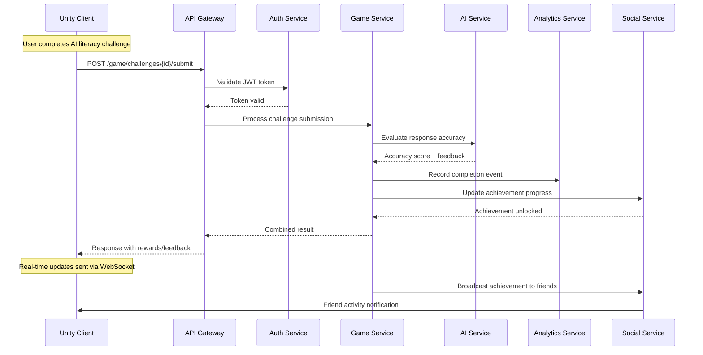
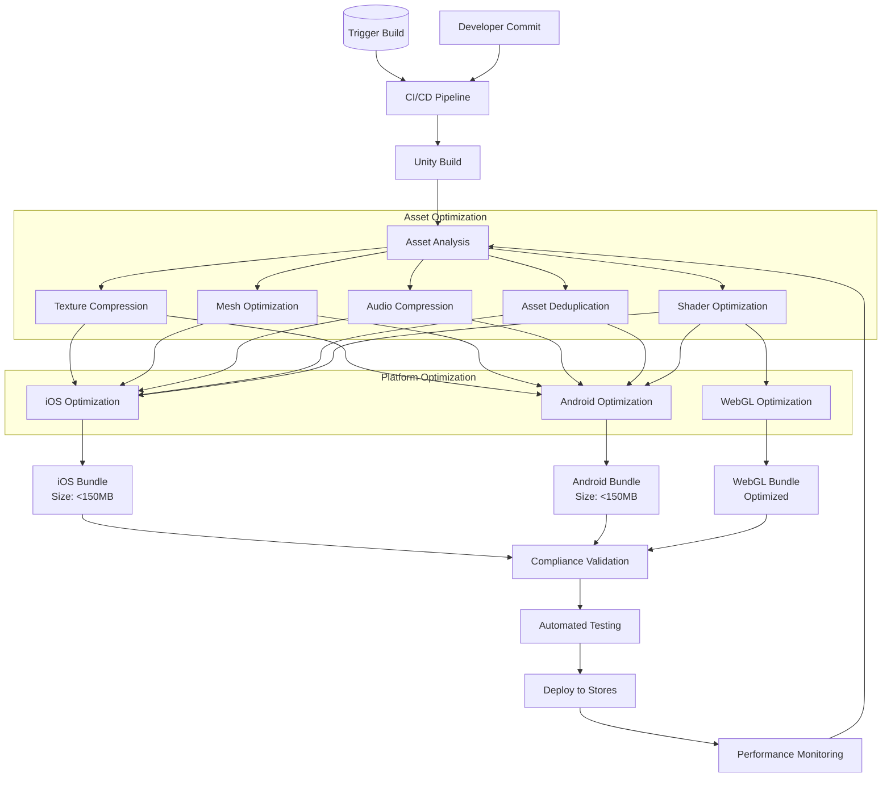
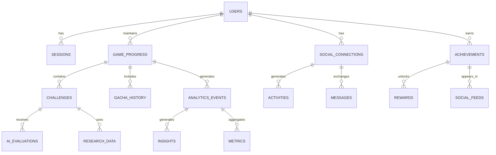
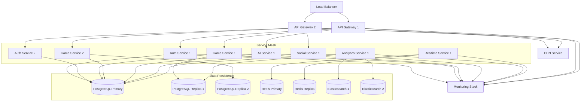
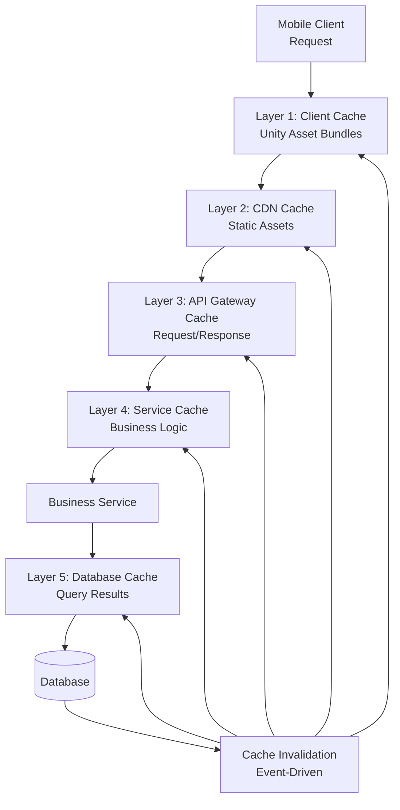

# 🏗️ ThinkRank System Architecture Overview

## Executive Summary

ThinkRank implements a microservices architecture optimized for mobile App Store acceleration, focusing on build optimization, viral growth mechanics, compliance validation, and backend API performance. The architecture supports Unity client deployment with 30%+ bundle size reduction, <200ms API response times, >0.15 viral coefficient, and >80/100 App Store metadata score targets.

**Architecture Principles:**
- **Mobile-First**: Performance optimization for iOS/Android constraints
- **Microservices**: Modular, scalable service boundaries with clear interfaces
- **Build Optimization**: Automated bundle analysis and platform-specific optimization
- **Viral Growth**: Social features and gacha mechanics for user acquisition
- **Compliance-First**: Automated App Store guideline validation and metadata optimization

---

## 2. System Context Diagram

```mermaid
graph TB
    %% External Systems
    subgraph "External Dependencies"
        AS[App Store Connect]
        GP[Google Play Console]
        APNS[Apple Push Notification Service]
        FCM[Firebase Cloud Messaging]
        SNS[Social Networks]
        CDN[CDN Services]
    end

    %% Mobile Clients
    subgraph "Mobile Clients"
        IOS[iOS Unity Client]
        AND[Android Unity Client]
        WEB[WebGL Client]
    end

    %% API Gateway
    APIGW[API Gateway Service]

    %% Core Microservices
    subgraph "Core Services"
        AUTH[Authentication Service]
        GAME[Game Service]
        AI[AI Research Service]
        SOCIAL[Social Service]
        ANALYTICS[Analytics Service]
        REALTIME[Realtime Service]
    end

    %% Infrastructure
    subgraph "Infrastructure"
        DB[(PostgreSQL Cluster)]
        REDIS[(Redis Cluster)]
        ES[(Elasticsearch)]
        MON[Monitoring/Grafana]
        LOGS[Logging System]
        CACHE[CDN Cache]
    end

    %% Data Flow Connections
    IOS --> APIGW
    AND --> APIGW
    WEB --> APIGW

    APIGW --> AUTH
    APIGW --> GAME
    APIGW --> AI
    APIGW --> SOCIAL
    APIGW --> ANALYTICS
    APIGW --> REALTIME

    AUTH --> DB
    GAME --> DB
    AI --> DB
    SOCIAL --> DB
    ANALYTICS --> DB
    ANALYTICS --> ES

    REALTIME --> REDIS

    %% External Integrations
    APIGW --> AS
    APIGW --> GP
    APIGW --> APNS
    APIGW --> FCM
    APIGW --> CDN

    %% Monitoring
    AUTH --> MON
    GAME --> MON
    AI --> MON
    SOCIAL --> MON
    ANALYTICS --> MON
    REALTIME --> MON
    APIGW --> MON

    %% Logging
    AUTH --> LOGS
    GAME --> LOGS
    AI --> LOGS
    SOCIAL --> LOGS
    ANALYTICS --> LOGS
    REALTIME --> LOGS
    APIGW --> LOGS

    %% Styling
    classDef external fill:#e1f5fe,stroke:#01579b,stroke-width:2px
    classDef mobile fill:#f3e5f5,stroke:#4a148c,stroke-width:2px
    classDef gateway fill:#fff3e0,stroke:#e65100,stroke-width:2px
    classDef services fill:#e8f5e8,stroke:#1b5e20,stroke-width:2px
    classDef infrastructure fill:#fce4ec,stroke:#880e4f,stroke-width:2px

    class AS,GP,APNS,FCM,SNS,CDN external
    class IOS,AND,WEB mobile
    class APIGW gateway
    class AUTH,GAME,AI,SOCIAL,ANALYTICS,REALTIME services
    class DB,REDIS,ES,MON,LOGS,CACHE infrastructure
```



### 2.1 System Context Legend
- **Blue**: External App Store and notification services
- **Purple**: Mobile client applications (iOS, Android, WebGL)
- **Orange**: API Gateway handling all client requests
- **Green**: Core business microservices
- **Pink**: Infrastructure and data storage systems

---

## 3. Service Boundary Definitions

### 3.1 Service Responsibilities Matrix

| Service | Primary Responsibility | Data Ownership | Key Interfaces | Performance Targets |
|---------|----------------------|----------------|----------------|-------------------|
| **Authentication** | User identity and access management | Users, sessions, tokens | OAuth 2.0, JWT, SSO | <50ms auth response |
| **Game** | Core gameplay logic and progression | Game state, challenges, scores | REST APIs, WebSocket events | <100ms game actions |
| **AI Research** | AI-powered content and analysis | Research data, AI models, evaluations | ML inference APIs, content APIs | <200ms AI responses |
| **Social** | Social features and interactions | Friends, activities, achievements | Social graph APIs, activity feeds | <100ms social actions |
| **Analytics** | User behavior and system metrics | Events, metrics, insights | Event ingestion, query APIs | <150ms analytics queries |
| **Realtime** | Real-time communication | Active sessions, live updates | WebSocket, Server-Sent Events | <50ms message delivery |
| **API Gateway** | Request routing and optimization | Request/response data | Rate limiting, caching, compression | <10ms routing overhead |

### 3.2 Service Interface Definitions

#### 3.2.1 Authentication Service Interfaces
```typescript
interface AuthService {
  // User Management
  POST /auth/register: RegisterRequest → UserResponse
  POST /auth/login: LoginRequest → AuthTokens
  POST /auth/refresh: RefreshToken → AuthTokens
  POST /auth/logout: LogoutRequest → SuccessResponse

  // Token Management
  POST /auth/verify: VerifyTokenRequest → TokenStatus
  POST /auth/revoke: RevokeTokenRequest → SuccessResponse

  // Password Management
  POST /auth/password/reset: ResetPasswordRequest → SuccessResponse
  POST /auth/password/change: ChangePasswordRequest → SuccessResponse
}
```

#### 3.2.2 Game Service Interfaces
```typescript
interface GameService {
  // Challenge Management
  GET /game/challenges: ChallengeQuery → ChallengeList
  POST /game/challenges/{id}/start: StartChallengeRequest → ChallengeSession
  POST /game/challenges/{id}/submit: SubmitAnswerRequest → EvaluationResult
  GET /game/challenges/{id}/progress: ProgressQuery → ChallengeProgress

  // Progression Tracking
  GET /game/progression: UserQuery → UserProgression
  POST /game/progression/update: ProgressionUpdate → UpdatedProgression

  // Gacha System
  POST /game/gacha/pull: GachaPullRequest → RewardResult
  GET /game/gacha/history: HistoryQuery → PullHistory
}
```

---

## 4. Critical Data Flow Diagrams

### 4.1 User Challenge Completion Flow



### 4.2 Build Optimization Pipeline Flow



---

## 5. Component Relationship Matrix

### 5.1 Service Dependencies

| Service | Depends On | Provides To | Communication Pattern |
|---------|------------|-------------|---------------------|
| **API Gateway** | All Services | Mobile Clients | Synchronous REST/WebSocket |
| **Authentication** | Database | All Services | JWT tokens, OAuth flows |
| **Game** | Auth, AI, Analytics | API Gateway | Challenge lifecycle, scoring |
| **AI Research** | Database, ML Models | Game, Analytics | Content analysis, evaluation |
| **Social** | Auth, Analytics | Game, API Gateway | Social graph, achievements |
| **Analytics** | All Services | All Services | Event tracking, insights |
| **Realtime** | Redis | All Services | WebSocket, live updates |

### 5.2 Data Consistency Model



---

## 6. Deployment Architecture

### 6.1 Infrastructure Components



### 6.2 Deployment Strategy

#### 6.2.1 Blue-Green Deployment Pattern
- **Blue Environment**: Production traffic (v1.0.0)
- **Green Environment**: Staging with new features (v1.1.0)
- **Switching**: Automated cutover with health checks
- **Rollback**: Instant rollback capability with data consistency

#### 6.2.2 Auto-scaling Configuration
| Service | Min Replicas | Max Replicas | CPU Threshold | Memory Threshold |
|---------|--------------|--------------|---------------|------------------|
| API Gateway | 3 | 20 | 70% | 80% |
| Authentication | 2 | 10 | 60% | 75% |
| Game | 2 | 15 | 65% | 70% |
| AI Research | 1 | 8 | 80% | 85% |
| Social | 2 | 12 | 70% | 75% |
| Analytics | 1 | 6 | 75% | 80% |
| Realtime | 2 | 25 | 60% | 70% |

---

## 7. Security Architecture Overview

### 7.1 End-to-End Security Flow

```mermaid
flowchart LR
    %% Client Security
    CLIENT_CERT[Client Certificate<br/>Validation]
    DEVICE_AUTH[Device Authentication]
    TOKEN_VALID[Token Validation]

    %% Transport Security
    TLS[TLS 1.3 Encryption]
    CERT_PIN[Certificate Pinning]

    %% API Security
    AUTH_MIDDLEWARE[Authentication<br/>Middleware]
    AUTHZ_MIDDLEWARE[Authorization<br/>Middleware]
    RATE_LIMIT[Rate Limiting]
    INPUT_SANITIZE[Input Sanitization]

    %% Service Security
    SERVICE_AUTH[Inter-service<br/>Authentication]
    DATA_ENCRYPTION[Data Encryption<br/>at Rest]
    AUDIT_LOGGING[Comprehensive<br/>Audit Logging]

    %% Data Security
    DB_ENCRYPTION[Database<br/>Encryption]
    BACKUP_ENCRYPTION[Backup<br/>Encryption]
    ACCESS_CONTROLS[Row-level<br/>Access Controls]

    %% Mobile Client --> Transport
    CLIENT_CERT --> TLS
    DEVICE_AUTH --> TLS
    TOKEN_VALID --> TLS

    TLS --> CERT_PIN

    %% API Gateway Security
    CERT_PIN --> AUTH_MIDDLEWARE
    AUTH_MIDDLEWARE --> AUTHZ_MIDDLEWARE
    AUTHZ_MIDDLEWARE --> RATE_LIMIT
    RATE_LIMIT --> INPUT_SANITIZE

    %% Service Layer Security
    INPUT_SANITIZE --> SERVICE_AUTH
    SERVICE_AUTH --> DATA_ENCRYPTION
    DATA_ENCRYPTION --> AUDIT_LOGGING

    %% Data Layer Security
    AUDIT_LOGGING --> DB_ENCRYPTION
    DB_ENCRYPTION --> BACKUP_ENCRYPTION
    BACKUP_ENCRYPTION --> ACCESS_CONTROLS
```



### 7.2 Security Compliance Matrix

| Security Layer | Implementation | Compliance | Monitoring |
|----------------|---------------|------------|------------|
| **Transport** | TLS 1.3, Certificate Pinning | SOC 2, PCI DSS | Certificate monitoring |
| **Authentication** | OAuth 2.0, JWT, MFA | SOC 2, GDPR | Failed login tracking |
| **Authorization** | RBAC, ABAC | SOC 2, HIPAA | Access violation alerts |
| **Input Validation** | Server-side sanitization | OWASP Top 10 | Injection attempt detection |
| **Data Protection** | AES-256 encryption | SOC 2, GDPR | Encryption key rotation |
| **Audit Logging** | Comprehensive trails | SOC 2, GDPR | Log integrity verification |

---

## 8. Performance Optimization Patterns

### 8.1 Mobile API Optimization

#### 8.1.1 Multi-Level Caching Strategy


#### 8.1.2 API Response Optimization
- **Compression**: Gzip/Brotli compression for all responses
- **Minification**: JSON response minification
- **Pagination**: Intelligent pagination with cursor-based navigation
- **Conditional Requests**: ETag/Last-Modified headers for caching
- **Response Streaming**: Progressive loading for large datasets

### 8.2 Build Optimization Pipeline

#### 8.2.1 Asset Optimization Workflow
1. **Analysis Phase**: Bundle analysis and dependency mapping
2. **Compression Phase**: Platform-specific texture/audio compression
3. **Optimization Phase**: Mesh optimization and LOD generation
4. **Packaging Phase**: Asset bundling with deduplication
5. **Validation Phase**: Quality verification and compliance checking

#### 8.2.2 Platform-Specific Optimizations
| Platform | Texture Compression | Audio Codec | Bundle Format | Size Limit |
|----------|-------------------|-------------|---------------|------------|
| **iOS** | ASTC/PVRTC | AAC/OPUS | IPA | 150MB cellular |
| **Android** | ETC2/ASTC | AAC/OPUS | APK/AAB | 150MB cellular |
| **WebGL** | WebP/AVIF | WebM/OGG | ZIP | Optimized streaming |

---

## 9. Service-Level Objectives (SLOs)

### 9.1 Performance SLOs
| Service | Response Time | Availability | Throughput | Error Rate |
|---------|---------------|--------------|------------|------------|
| API Gateway | <10ms | 99.95% | 10,000 RPS | <0.1% |
| Authentication | <50ms | 99.9% | 1,000 RPS | <0.01% |
| Game | <100ms | 99.9% | 5,000 RPS | <0.1% |
| AI Research | <200ms | 99.5% | 500 RPS | <1% |
| Social | <100ms | 99.9% | 2,000 RPS | <0.1% |
| Analytics | <150ms | 99.5% | 1,000 RPS | <0.5% |
| Realtime | <50ms | 99.9% | 5,000 concurrent | <0.01% |

### 9.2 Quality SLOs
- **Bundle Size**: 30% reduction from baseline, <150MB per platform
- **Viral Coefficient**: >0.15 through social features
- **App Store Score**: >80/100 metadata optimization score
- **Crash Rate**: <0.1% across all platforms
- **User Retention**: >70% D1 retention, >40% D7 retention

---

## 10. Architecture Decision Records

### 10.1 Microservices Pattern Selection

**Decision**: Implement microservices architecture with 7 bounded contexts

**Rationale**:
- Enables independent scaling of game logic, AI processing, and social features
- Supports mobile-first optimization requirements
- Allows for independent deployment and rollback capabilities
- Facilitates App Store compliance validation per service

**Trade-offs**:
- Increased operational complexity vs. monolithic architecture
- Network latency overhead vs. in-process communication
- Requires sophisticated monitoring and tracing

### 10.2 Mobile API Optimization Strategy

**Decision**: Implement multi-level caching with API response optimization

**Rationale**:
- Critical for achieving <200ms response time requirement
- Reduces server load and bandwidth costs
- Improves user experience on poor network conditions
- Supports offline functionality requirements

**Trade-offs**:
- Cache invalidation complexity vs. data freshness
- Storage costs vs. performance benefits
- Implementation complexity vs. development speed

### 10.3 Build Optimization Pipeline

**Decision**: Automated build pipeline with platform-specific optimization

**Rationale**:
- Essential for 30%+ bundle size reduction target
- Supports App Store cellular download limits (<150MB)
- Enables platform-specific compression and optimization
- Provides automated compliance validation

**Trade-offs**:
- Build time increase vs. runtime performance gains
- Pipeline complexity vs. manual optimization
- Storage requirements vs. optimization benefits

---

## 11. Next Steps and Implementation Roadmap

### 11.1 Immediate Priorities (Phase 1)
1. **API Gateway Implementation**: Core routing and authentication
2. **Authentication Service**: User management and token handling
3. **Basic Game Service**: Challenge lifecycle and scoring
4. **Database Schema**: User and game state persistence

### 11.2 Short-term Goals (Phase 2)
1. **AI Research Service**: Content analysis and evaluation
2. **Social Service**: Friend system and achievements
3. **Mobile Optimization**: Caching and compression layers
4. **Build Pipeline**: Asset optimization automation

### 11.3 Medium-term Objectives (Phase 3)
1. **Analytics Service**: User behavior tracking and insights
2. **Realtime Service**: WebSocket communication
3. **Viral Growth Features**: Gacha system and social sharing
4. **App Store Integration**: Metadata optimization and compliance

### 11.4 Long-term Vision (Phase 4)
1. **Advanced AI Features**: Personalized learning and adaptation
2. **Global Expansion**: Multi-language and cultural adaptation
3. **Enterprise Integration**: Educational institution partnerships
4. **Advanced Analytics**: Predictive modeling and recommendations

---

**Architecture Status**: DRAFT | **Last Updated**: 2025-09-27 | **Version**: 1.0.0
**Owner**: Architecture Team | **Next Review**: Service Implementation Phase