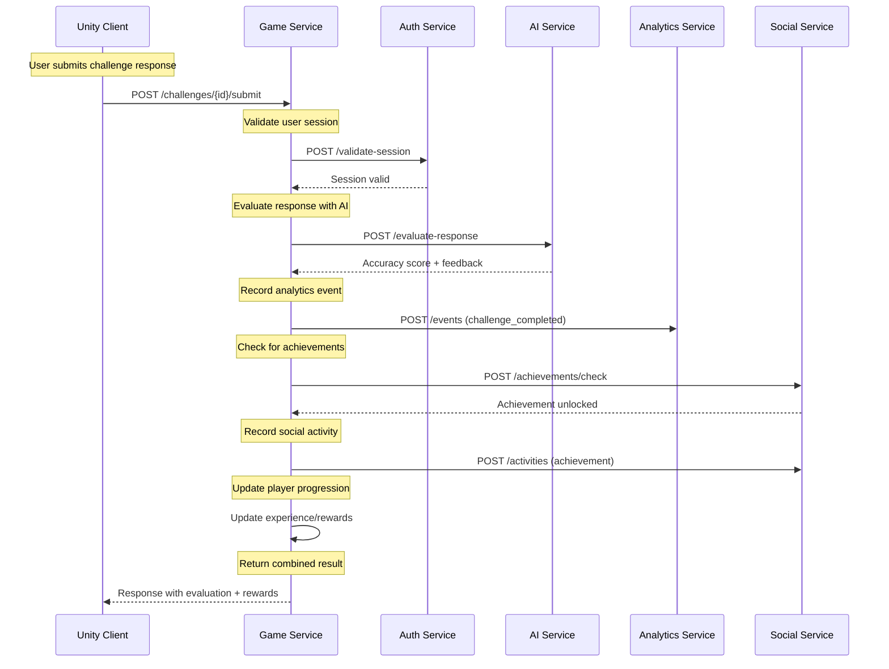
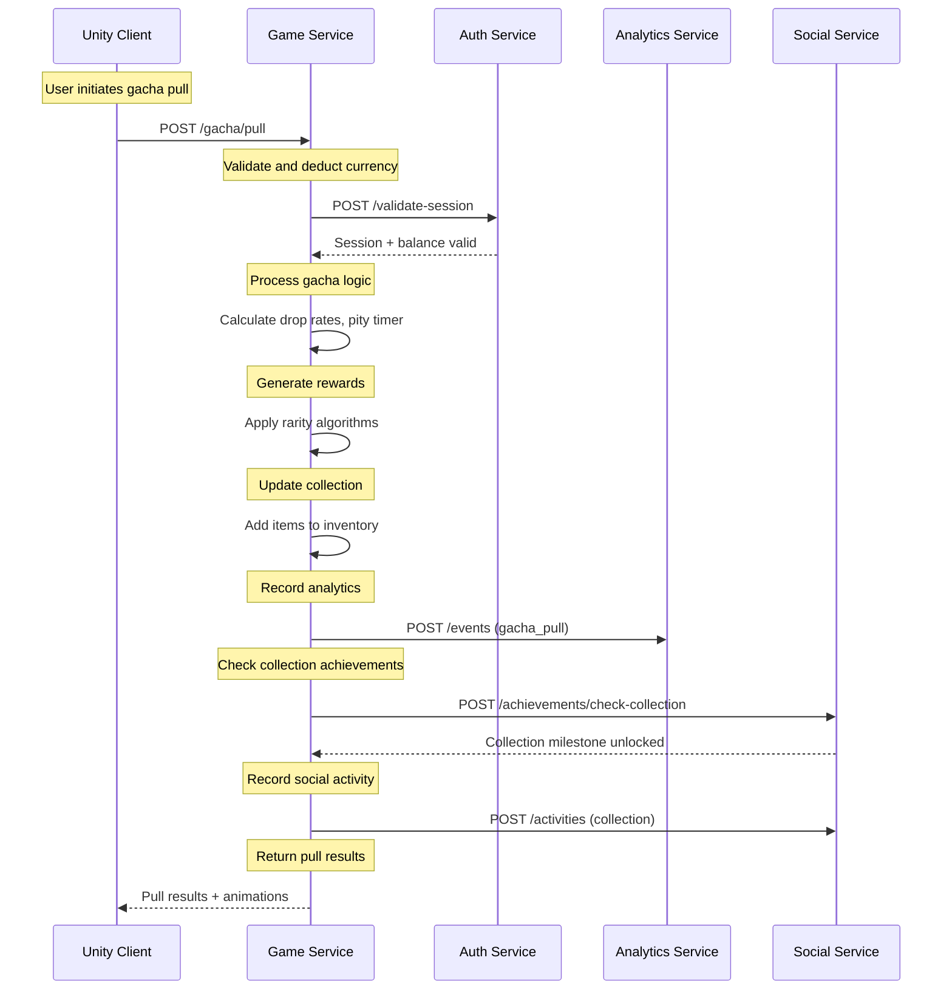
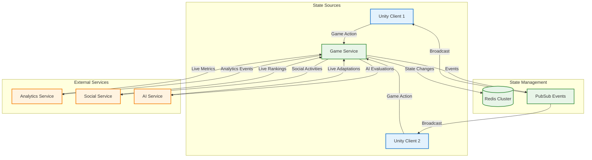

# 🏗️ Game Service API Contracts Architecture

## Executive Summary

This document defines extensible system diagrams and service boundaries for Game Service API contracts, establishing clear interfaces between the Game Service and existing services (Analytics, Social, AI Domain, Authentication, and Shared Package). The architecture emphasizes modular boundaries, maintains extensibility, and provides comprehensive integration patterns for the gamified AI literacy platform.

## 1. Service Boundary Definitions

### 1.1 Game Service Core Responsibilities

| Component | Responsibility | Data Ownership | Key Interfaces | Performance Targets |
|-----------|---------------|----------------|------------------|-------------------|
| **Game Engine** | Core gameplay orchestration and state management | Game sessions, player progression, challenge state | Game lifecycle APIs, state synchronization | <100ms action processing |
| **Challenge Manager** | AI literacy challenge lifecycle and evaluation | Challenges, responses, scoring | Challenge APIs, evaluation interfaces | <200ms evaluation responses |
| **Gacha System** | Reward mechanics and collection management | Pull history, inventory, rarity logic | Gacha APIs, reward distribution | <150ms pull processing |
| **Progress Tracker** | Player progression and achievement tracking | Experience, levels, milestones | Progression APIs, analytics events | <50ms state updates |

### 1.2 Integration Service Boundaries

#### Authentication Service Integration
```typescript
interface AuthIntegration {
  // Session Management
  POST /auth/validate-session: ValidateSessionRequest → SessionStatus
  POST /auth/refresh-tokens: RefreshTokenRequest → TokenPair
  POST /auth/terminate-session: SessionId → SuccessResponse

  // User Context
  GET /auth/user-profile/{userId}: UserContextRequest → UserProfile
  POST /auth/user-preferences: UpdatePreferencesRequest → UserPreferences
}
```

#### AI Domain Service Integration
```typescript
interface AIDomainIntegration {
  // Challenge Generation
  POST /ai/challenges/generate: ChallengeGenerationRequest → ChallengeDefinition
  GET /ai/challenges/templates: TemplateQuery → ChallengeTemplate[]

  // Response Evaluation
  POST /ai/evaluate-response: EvaluationRequest → EvaluationResult
  GET /ai/bias-types: Query → BiasTypeDefinition[]

  // Adaptive Learning
  POST /ai/adapt-difficulty: AdaptationRequest → DifficultyAdjustment
  GET /ai/learning-progress/{userId}: ProgressQuery → LearningMetrics
}
```

#### Analytics Service Integration
```typescript
interface AnalyticsIntegration {
  // Event Tracking
  POST /analytics/events: TrackEventRequest → EventAck
  POST /analytics/events/batch: BatchEventRequest → BatchAck

  // Metrics Queries
  GET /analytics/metrics/game-engagement: MetricsQuery → EngagementMetrics
  GET /analytics/metrics/learning-outcomes: LearningQuery → LearningMetrics

  // Real-time Analytics
  WS /analytics/stream/{userId}: RealTimeMetricsStream
}
```

#### Social Service Integration
```typescript
interface SocialIntegration {
  // Achievement System
  POST /social/achievements/unlock: AchievementUnlockRequest → AchievementResult
  GET /social/achievements/{userId}: UserQuery → UserAchievements

  // Leaderboards
  GET /social/leaderboards/{category}: LeaderboardQuery → RankingData
  POST /social/leaderboards/update: ScoreUpdateRequest → RankingUpdate

  // Social Graph
  GET /social/friends/{userId}: FriendsQuery → FriendsList
  POST /social/activities/share: ShareActivityRequest → ShareResult
}
```

## 2. API Endpoint Specifications

### 2.1 Core Game APIs

#### 2.1.1 Game Session Management
```typescript
// Session Lifecycle
POST /api/game/sessions/start
Content-Type: application/json
Authorization: Bearer {token}

{
  "userId": "string",
  "gameMode": "challenge|progression|gacha",
  "initialState": {
    "level": "number",
    "preferences": "object"
  }
}

Response: 201 Created
{
  "sessionId": "string",
  "gameState": "GameState",
  "expiresAt": "ISO8601"
}
```

#### 2.1.2 Challenge Processing
```typescript
POST /api/game/challenges/{challengeId}/submit
Content-Type: application/json
Authorization: Bearer {token}

{
  "sessionId": "string",
  "response": {
    "biasDetection": "object",
    "confidence": "number",
    "rationale": "string"
  },
  "metadata": {
    "timeSpent": "number",
    "hintsUsed": "number"
  }
}

Response: 200 OK
{
  "evaluation": {
    "accuracy": "number",
    "feedback": "string",
    "biasTypes": ["string"],
    "learningObjectives": ["string"]
  },
  "rewards": {
    "experience": "number",
    "items": ["Item"],
    "achievements": ["Achievement"]
  },
  "nextChallenge": "Challenge | null"
}
```

#### 2.1.3 Gacha System
```typescript
POST /api/game/gacha/pull
Content-Type: application/json
Authorization: Bearer {token}

{
  "sessionId": "string",
  "pullType": "single|multi",
  "currency": {
    "type": "premium|free",
    "amount": "number"
  }
}

Response: 200 OK
{
  "pullId": "string",
  "results": [{
    "item": "CollectionItem",
    "rarity": "ItemRarity",
    "new": "boolean"
  }],
  "pityCounter": {
    "current": "number",
    "required": "number"
  },
  "guaranteedDrop": "boolean"
}
```

### 2.2 Cross-Service Integration APIs

#### 2.2.1 Analytics Integration Events
```typescript
// Challenge Completion Event
POST /analytics/events
{
  "eventType": "challenge_completed",
  "userId": "string",
  "sessionId": "string",
  "properties": {
    "challengeId": "string",
    "challengeType": "bias_detection|research_workflow",
    "accuracy": "number",
    "timeSpent": "number",
    "biasTypes": ["string"],
    "difficulty": "string"
  },
  "timestamp": "ISO8601"
}

// Gacha Pull Event
POST /analytics/events
{
  "eventType": "gacha_pull",
  "userId": "string",
  "sessionId": "string",
  "properties": {
    "pullType": "single|multi",
    "currencyType": "premium|free",
    "results": ["item"],
    "pityCounter": "number",
    "guaranteedDrop": "boolean"
  },
  "timestamp": "ISO8601"
}
```

#### 2.2.2 Social Integration Events
```typescript
// Achievement Unlocked Event
POST /social/activities
{
  "userId": "string",
  "activityType": "achievement_unlocked",
  "achievement": {
    "id": "string",
    "name": "string",
    "description": "string",
    "rarity": "string",
    "category": "learning|progression|social"
  },
  "shareable": "boolean",
  "timestamp": "ISO8601"
}

// Collection Milestone Event
POST /social/activities
{
  "userId": "string",
  "activityType": "collection_milestone",
  "milestone": {
    "type": "bias_types_collected|total_items|rarity_achieved",
    "value": "number",
    "threshold": "number"
  },
  "timestamp": "ISO8601"
}
```

## 3. Data Flow Architecture

### 3.1 Challenge Completion Flow



### 3.2 Gacha Pull Flow



### 3.3 Real-time State Synchronization



## 4. Integration Patterns

### 4.1 Service Communication Patterns

#### 4.1.1 Synchronous Request-Response
```typescript
// Direct API calls for immediate responses
class GameServiceClient {
  async submitChallenge(challengeId: string, response: any): Promise<ChallengeResult> {
    // Direct call to AI service for evaluation
    const evaluation = await this.aiClient.evaluateResponse(challengeId, response);

    // Direct call to analytics for event tracking
    await this.analyticsClient.trackEvent('challenge_submitted', {
      challengeId,
      response,
      evaluation
    });

    // Aggregate results
    return {
      evaluation,
      analytics: { tracked: true },
      nextSteps: this.calculateNextSteps(evaluation)
    };
  }
}
```

#### 4.1.2 Asynchronous Event-Driven
```typescript
// Event publishing for eventual consistency
class EventDrivenGameService {
  async completeChallenge(challengeId: string, userId: string): Promise<void> {
    // Publish completion event
    await this.eventPublisher.publish('challenge.completed', {
      challengeId,
      userId,
      timestamp: new Date(),
      metadata: { source: 'game-service' }
    });

    // Other services consume the event
    // - Analytics: Track completion metrics
    // - Social: Check for achievements
    // - AI: Update learning progression
  }
}
```

#### 4.1.3 Circuit Breaker Pattern
```typescript
// Resilience pattern for service dependencies
class ResilientGameService {
  private circuitBreakers: Map<string, CircuitBreaker> = new Map();

  async evaluateWithAI(challengeId: string, response: any): Promise<EvaluationResult> {
    const aiBreaker = this.circuitBreakers.get('ai-service');

    return aiBreaker.execute(async () => {
      try {
        return await this.aiClient.evaluateResponse(challengeId, response);
      } catch (error) {
        // Fallback to cached evaluation or basic scoring
        return this.getFallbackEvaluation(response);
      }
    });
  }
}
```

### 4.2 Data Consistency Patterns

#### 4.2.1 Event Sourcing
```typescript
interface GameEvent {
  id: string
  aggregateId: string
  eventType: 'ChallengeStarted' | 'ChallengeSubmitted' | 'GachaPulled'
  data: any
  timestamp: Date
  version: number
}

class EventSourcedGameService {
  async processAction(action: GameAction): Promise<GameState> {
    // Load current state from events
    const events = await this.eventStore.getEvents(action.sessionId);
    const currentState = this.rehydrateState(events);

    // Apply business logic
    const newEvents = this.processBusinessLogic(currentState, action);

    // Persist new events
    await this.eventStore.appendEvents(newEvents);

    // Return new state
    return this.rehydrateState([...events, ...newEvents]);
  }
}
```

#### 4.2.2 CQRS Pattern
```typescript
// Separate read/write models
class CQRSGameService {
  // Write side - Complex business logic
  async submitChallenge(command: SubmitChallengeCommand): Promise<void> {
    // Complex validation and business rules
    await this.validateChallenge(command);
    await this.processChallenge(command);
    await this.updateProgression(command);
    await this.distributeRewards(command);

    // Publish events for read models
    await this.eventPublisher.publish('ChallengeSubmitted', command);
  }

  // Read side - Optimized queries
  async getPlayerProgression(query: GetProgressionQuery): Promise<PlayerProgression> {
    // Optimized read from denormalized view
    return this.progressionReadModel.getProgression(query.playerId);
  }
}
```

## 5. Service Interface Definitions

### 5.1 TypeScript Interface Contracts

#### 5.1.1 Core Game Interfaces
```typescript
export interface IGameService {
  // Session Management
  startSession(request: StartSessionRequest): Promise<StartSessionResponse>
  endSession(request: EndSessionRequest): Promise<EndSessionResponse>
  getSessionState(request: GetSessionStateRequest): Promise<SessionState>

  // Challenge Management
  getAvailableChallenges(request: GetChallengesRequest): Promise<ChallengeList>
  startChallenge(request: StartChallengeRequest): Promise<ChallengeSession>
  submitChallenge(request: SubmitChallengeRequest): Promise<ChallengeResult>

  // Gacha System
  performGachaPull(request: GachaPullRequest): Promise<GachaResult>
  getCollection(request: GetCollectionRequest): Promise<Collection>

  // Progression
  getPlayerProgression(request: GetProgressionRequest): Promise<PlayerProgression>
  updateProgression(request: UpdateProgressionRequest): Promise<ProgressionUpdate>
}
```

#### 5.1.2 Cross-Service Interface Contracts
```typescript
// Authentication Integration Contract
export interface IAuthServiceClient {
  validateSession(token: string): Promise<SessionValidation>
  getUserProfile(userId: string): Promise<UserProfile>
  updateUserPreferences(userId: string, prefs: UserPreferences): Promise<void>
}

// AI Service Integration Contract
export interface IAIServiceClient {
  evaluateChallenge(request: ChallengeEvaluationRequest): Promise<EvaluationResult>
  generateAdaptiveChallenge(request: AdaptiveChallengeRequest): Promise<Challenge>
  updateLearningProgress(request: LearningProgressUpdate): Promise<LearningMetrics>
}

// Analytics Integration Contract
export interface IAnalyticsServiceClient {
  trackEvent(event: AnalyticsEvent): Promise<void>
  trackEvents(events: AnalyticsEvent[]): Promise<void>
  getPlayerMetrics(request: PlayerMetricsRequest): Promise<PlayerMetrics>
}

// Social Integration Contract
export interface ISocialServiceClient {
  unlockAchievement(request: AchievementUnlockRequest): Promise<AchievementResult>
  updateLeaderboard(request: LeaderboardUpdateRequest): Promise<void>
  shareActivity(request: ShareActivityRequest): Promise<ShareResult>
}
```

### 5.2 Data Transfer Objects (DTOs)

#### 5.2.1 Request/Response DTOs
```typescript
export interface ChallengeSubmissionRequest {
  challengeId: string
  sessionId: string
  userId: string
  response: {
    biasDetection: BiasDetectionResult
    confidence: number
    rationale: string
    metadata: {
      timeSpent: number
      hintsUsed: number
      attempts: number
    }
  }
}

export interface ChallengeSubmissionResponse {
  evaluation: {
    accuracy: number
    feedback: string
    biasTypes: string[]
    learningObjectives: string[]
    nextSteps: string[]
  }
  rewards: {
    experience: number
    items: CollectionItem[]
    achievements: Achievement[]
    currency: CurrencyReward[]
  }
  progression: {
    level: number
    totalExperience: number
    nextLevelProgress: number
  }
}
```

## 6. Error Handling and Resilience

### 6.1 Error Classification
```typescript
enum ErrorCategory {
  VALIDATION = 'validation',
  AUTHENTICATION = 'authentication',
  AUTHORIZATION = 'authorization',
  BUSINESS_LOGIC = 'business_logic',
  EXTERNAL_SERVICE = 'external_service',
  SYSTEM = 'system'
}

interface ServiceError {
  category: ErrorCategory
  code: string
  message: string
  details?: any
  retryable: boolean
  timestamp: Date
}
```

### 6.2 Resilience Patterns
```typescript
class ResilientGameService {
  async executeWithRetry<T>(
    operation: () => Promise<T>,
    maxRetries: number = 3,
    backoffMs: number = 1000
  ): Promise<T> {
    for (let attempt = 1; attempt <= maxRetries; attempt++) {
      try {
        return await operation();
      } catch (error) {
        if (attempt === maxRetries || !this.isRetryableError(error)) {
          throw error;
        }

        await this.delay(backoffMs * attempt);
      }
    }
  }

  private isRetryableError(error: ServiceError): boolean {
    return error.retryable &&
           error.category !== ErrorCategory.VALIDATION &&
           error.category !== ErrorCategory.AUTHENTICATION;
  }
}
```

## 7. Observability and Monitoring

### 7.1 Metrics Collection
```typescript
interface GameServiceMetrics {
  // Performance Metrics
  challengeEvaluationLatency: Histogram
  gachaPullLatency: Histogram
  sessionDuration: Histogram

  // Business Metrics
  challengesCompleted: Counter
  gachaPullsPerformed: Counter
  achievementsUnlocked: Counter

  // Error Metrics
  serviceErrors: Counter
  externalServiceTimeouts: Counter
  circuitBreakerTrips: Counter
}
```

### 7.2 Distributed Tracing
```typescript
class TracedGameService {
  async submitChallenge(
    request: ChallengeSubmissionRequest,
    span: Span
  ): Promise<ChallengeSubmissionResponse> {
    return this.tracer.startActiveSpan('game.challenge.submit', async (span) => {
      try {
        // Add request context
        span.setTag('challenge.id', request.challengeId);
        span.setTag('user.id', request.userId);

        // Call AI service with child span
        const evaluation = await this.tracer.startActiveSpan(
          'ai.evaluate',
          async (aiSpan) => {
            aiSpan.setTag('service', 'ai-service');
            return this.aiClient.evaluateChallenge(request);
          }
        );

        // Call analytics service with child span
        await this.tracer.startActiveSpan(
          'analytics.track',
          async (analyticsSpan) => {
            analyticsSpan.setTag('service', 'analytics-service');
            return this.analyticsClient.trackChallengeCompletion(request, evaluation);
          }
        );

        span.setTag('evaluation.accuracy', evaluation.accuracy);

        return { evaluation, rewards: [], progression: null };

      } catch (error) {
        span.setTag('error', true);
        span.log({ error: error.message });
        throw error;
      } finally {
        span.finish();
      }
    });
  }
}
```

## 8. Security Integration

### 8.1 Authentication and Authorization
```typescript
class SecureGameService {
  async processAuthenticatedAction(
    token: string,
    action: GameAction
  ): Promise<GameResult> {
    // Validate JWT token
    const session = await this.authClient.validateSession(token);

    // Check authorization
    await this.authorizationService.checkPermission(
      session.userId,
      'game:action',
      action.type
    );

    // Process action with user context
    return this.processAction({
      ...action,
      userId: session.userId,
      permissions: session.permissions
    });
  }
}
```

### 8.2 Data Protection
```typescript
class EncryptedGameService {
  async saveGameState(
    sessionId: string,
    state: GameState
  ): Promise<void> {
    // Encrypt sensitive state data
    const encryptedState = await this.encryptionService.encrypt(
      JSON.stringify(state)
    );

    // Save to persistent storage
    await this.stateRepository.save(sessionId, encryptedState);
  }

  async loadGameState(sessionId: string): Promise<GameState> {
    // Load encrypted state
    const encryptedState = await this.stateRepository.load(sessionId);

    // Decrypt state data
    const decryptedData = await this.encryptionService.decrypt(encryptedState);

    return JSON.parse(decryptedData);
  }
}
```

## 9. Deployment and Scalability

### 9.1 Service Scaling Configuration
```yaml
apiVersion: apps/v1
kind: Deployment
metadata:
  name: game-service
  labels:
    app: game-service
    component: core-game
spec:
  replicas: 5
  selector:
    matchLabels:
      app: game-service
  template:
    metadata:
      labels:
        app: game-service
    spec:
      containers:
      - name: game-service
        image: thinkrank/game-service:v1.0.0
        ports:
        - containerPort: 3000
        env:
        - name: REDIS_URL
          valueFrom:
            secretKeyRef:
              name: redis-cluster-secret
              key: url
        - name: AUTH_SERVICE_URL
          valueFrom:
            configMapKeyRef:
              name: service-config
              key: auth-service-url
        resources:
          requests:
            memory: "512Mi"
            cpu: "250m"
          limits:
            memory: "1Gi"
            cpu: "500m"
---
apiVersion: autoscaling/v2
kind: HorizontalPodAutoscaler
metadata:
  name: game-service-hpa
spec:
  scaleTargetRef:
    apiVersion: apps/v1
    kind: Deployment
    name: game-service
  minReplicas: 3
  maxReplicas: 20
  metrics:
  - type: Resource
    resource:
      name: cpu
      target:
        type: Utilization
        averageUtilization: 70
  - type: Resource
    resource:
      name: memory
      target:
        type: Utilization
        averageUtilization: 80
```

## 10. Versioning and Compatibility

### 10.1 API Versioning Strategy
```typescript
enum APIVersion {
  V1 = 'v1',
  V2 = 'v2'
}

class VersionedGameService {
  async handleRequest(
    version: APIVersion,
    endpoint: string,
    request: any
  ): Promise<any> {
    const handler = this.getVersionedHandler(version, endpoint);

    // Ensure backward compatibility
    const normalizedRequest = this.normalizeRequest(version, request);

    return handler(normalizedRequest);
  }

  private normalizeRequest(version: APIVersion, request: any): any {
    switch (version) {
      case APIVersion.V1:
        return this.upgradeV1ToV2(request);
      case APIVersion.V2:
        return request;
      default:
        throw new Error(`Unsupported API version: ${version}`);
    }
  }
}
```

### 10.2 Breaking Change Management
```typescript
interface MigrationGuide {
  fromVersion: string
  toVersion: string
  breakingChanges: BreakingChange[]
  migrationSteps: MigrationStep[]
  rollbackPlan: RollbackPlan
}

interface BreakingChange {
  changeType: 'endpoint_removed' | 'field_removed' | 'behavior_changed'
  description: string
  impact: 'high' | 'medium' | 'low'
  workaround?: string
}
```

## Summary

This Game Service API contracts architecture provides:

- **Clear Service Boundaries**: Well-defined responsibilities and data ownership
- **Extensible Interfaces**: Modular design supporting future enhancements
- **Robust Integration Patterns**: Multiple communication and consistency patterns
- **Comprehensive Observability**: Metrics, tracing, and monitoring integration
- **Security-First Design**: Authentication, authorization, and data protection
- **Scalable Architecture**: Auto-scaling and performance optimization
- **Version Compatibility**: Backward compatibility and migration strategies

The architecture enables seamless integration between the Game Service and all dependent services while maintaining high performance, reliability, and extensibility for the gamified AI literacy platform.