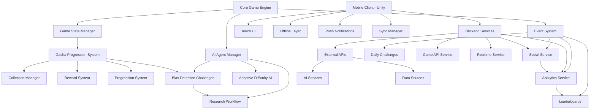

# ThinkRank Phase 1: Gamified AI Literacy Platform Architecture

## Executive Summary

This architecture blueprint defines a comprehensive gamified AI literacy platform that transforms learning about AI bias detection and research into an addictive viral sensation. Built on ThinkRank's existing microservices architecture, the platform combines gacha-style progression mechanics with educational content to create engaging, shareable learning experiences.

## Core Architectural Principles

### 1. **Gacha-Style Engagement Loop**
- **Collection Psychology**: Players collect AI bias scenarios like trading cards
- **Rarity-Based Rewards**: Common → Uncommon → Rare → Epic → Legendary progression
- **Compulsion Loops**: Daily pulls, pity timers, guaranteed drops
- **Social Proof**: Share collections, compare with friends

### 2. **AI Literacy Integration**
- **Bias Detection Challenges**: Real-world scenarios with immediate feedback
- **Research Workflow Gamification**: Turn academic processes into game mechanics
- **Adaptive Difficulty**: AI agents adjust challenge complexity
- **Progress Validation**: Educational outcomes tracked and verified

### 3. **Viral Growth Design**
- **Network Effects**: Friend referrals unlock exclusive content
- **Social Sharing**: Achievement screenshots, collection showcases
- **Competitive Elements**: Global leaderboards, seasonal events
- **FOMO Mechanics**: Limited-time events, exclusive rewards

## System Architecture Overview



## Component Architecture Details

### A. Modular Game Engine Architecture

#### Core Engine (`/backend/services/game-service/src/core/`)
```
GameEngine/
├── Core/
│   ├── GameEngine.ts           # Main orchestration engine
│   ├── StateManager.ts         # Optimistic state updates
│   ├── EventSystem.ts          # Real-time event broadcasting
│   └── AIAgentManager.ts       # Adaptive AI decision making
├── Progression/
│   ├── GachaSystem.ts          # Random reward generation
│   ├── CollectionManager.ts    # Card/scenario collection
│   ├── RewardEngine.ts         # Rarity-based rewards
│   └── UnlockSystem.ts         # Progressive content unlocks
├── Challenges/
│   ├── BiasDetection.ts        # AI bias identification
│   ├── ResearchWorkflow.ts     # Academic process gamification
│   └── AdaptiveDifficulty.ts   # Dynamic challenge scaling
└── Social/
    ├── SharingManager.ts       # Social media integration
    ├── AchievementSystem.ts    # Progress milestones
    ├── LeaderboardManager.ts   # Competitive rankings
    └── ReferralSystem.ts       # Friend invitation rewards
```

#### Key Classes & Interfaces

```typescript
// Core Game Engine Interface
interface IGameEngine {
  initialize(config: GameConfig): Promise<GameState>
  processAction(playerId: string, action: GameAction): Promise<GameState>
  handleEvent(event: GameEvent): Promise<void>
  getPlayerState(playerId: string): Promise<PlayerState>
}

// Gacha System Interface
interface IGachaSystem {
  performPull(playerId: string, pullType: PullType): Promise<GachaResult>
  getCollection(playerId: string): Promise<Collection>
  checkPityTimer(playerId: string): Promise<PityStatus>
  calculateDropRates(rarity: ItemRarity): number[]
}

// AI Research Integration
interface IResearchEngine {
  generateBiasChallenge(difficulty: Difficulty): Promise<BiasChallenge>
  validateAnswer(challengeId: string, answer: Answer): Promise<ValidationResult>
  adaptDifficulty(playerId: string, performance: PerformanceMetrics): Promise<Difficulty>
}
```

### B. Gacha-Style Progression System

#### Collection Mechanics
```typescript
enum ItemRarity {
  COMMON = "common",       // 60% drop rate
  UNCOMMON = "uncommon",   // 25% drop rate  
  RARE = "rare",          // 10% drop rate
  EPIC = "epic",          // 4% drop rate
  LEGENDARY = "legendary"  // 1% drop rate
}

interface CollectionItem {
  id: string
  name: string
  description: string
  rarity: ItemRarity
  category: ItemCategory
  educationalValue: EducationalMetadata
  visualAsset: AssetReference
  unlockRequirements?: UnlockCondition[]
}

interface GachaPull {
  id: string
  playerId: string
  pullType: PullType
  cost: PullCost
  results: CollectionItem[]
  timestamp: Date
  pityCounter: number
}
```

#### Progression Loops
```typescript
interface PlayerProgression {
  level: number
  experience: number
  totalPulls: number
  collectionCompletion: number
  achievements: Achievement[]
  streakData: StreakInfo
  socialMetrics: SocialMetrics
}

interface RewardSystem {
  calculateRewards(action: GameAction, context: GameContext): Reward[]
  applyRewards(playerId: string, rewards: Reward[]): Promise<void>
  checkMilestones(playerId: string): Promise<Milestone[]>
}
```

### C. AI Research Integration

#### Bias Detection Challenges
```typescript
interface BiasChallenge {
  id: string
  title: string
  description: string
  scenario: AIScenario
  biasTypes: BiasType[]
  difficulty: Difficulty
  educationalObjective: LearningObjective
  validationCriteria: ValidationRule[]
  hints: ChallengeHint[]
  estimatedTime: number
}

interface AIScenario {
  context: string
  data: any
  expectedBias: BiasType
  confidence: number
  realWorldReference?: string
}
```

#### Research Workflow Gamification
```typescript
interface ResearchWorkflow {
  stages: WorkflowStage[]
  currentStage: number
  progress: number
  rewards: WorkflowReward[]
  collaborative: boolean
  peerReview: boolean
}

enum WorkflowStage {
  HYPOTHESIS = "hypothesis",
  DATA_COLLECTION = "data_collection", 
  ANALYSIS = "analysis",
  VALIDATION = "validation",
  CONCLUSION = "conclusion"
}
```

### D. Viral Features

#### Social Sharing System
```typescript
interface SocialManager {
  shareAchievement(achievement: Achievement): Promise<ShareResult>
  shareCollection(collection: Collection): Promise<ShareResult>
  inviteFriends(referralCode: string): Promise<ReferralResult>
  trackSocialMetrics(playerId: string): Promise<SocialMetrics>
}

interface Achievement {
  id: string
  name: string
  description: string
  icon: AssetReference
  rarity: AchievementRarity
  shareable: boolean
  socialValue: number
  unlockConditions: Condition[]
}
```

#### Competitive Elements
```typescript
interface LeaderboardManager {
  updateRankings(category: LeaderboardCategory): Promise<void>
  getRankings(category: LeaderboardCategory, limit: number): Promise<Ranking[]>
  getPlayerRank(playerId: string, category: LeaderboardCategory): Promise<PlayerRank>
  calculateSeasonRewards(): Promise<SeasonReward[]>
}

enum LeaderboardCategory {
  BIAS_DETECTION_ACCURACY = "bias_accuracy",
  RESEARCH_COMPLETION = "research_completion",
  COLLECTION_SIZE = "collection_size",
  SOCIAL_ENGAGEMENT = "social_engagement",
  STREAK_LENGTH = "streak_length"
}
```

### E. Mobile Client Architecture

#### Unity Project Structure
```
unity-project/
├── Assets/
│   ├── Scripts/
│   │   ├── Core/
│   │   │   ├── GameManager.cs           # Unity game orchestration
│   │   │   ├── StateSynchronizer.cs     # Server state sync
│   │   │   └── EventHandler.cs         # Real-time events
│   │   ├── Gacha/
│   │   │   ├── GachaController.cs       # Pull animations
│   │   │   ├── CollectionView.cs        # Card collection UI
│   │   │   └── RewardPresenter.cs      # Reward animations
│   │   ├── AIChallenges/
│   │   │   ├── ChallengePresenter.cs   # Bias detection UI
│   │   │   ├── ResearchWorkflow.cs     # Workflow gamification
│   │   │   └── AdaptiveUI.cs           # Dynamic difficulty UI
│   │   └── Social/
│   │       ├── SharingController.cs    # Social media integration
│   │       ├── AchievementPopup.cs     # Achievement notifications
│   │       └── LeaderboardView.cs      # Rankings display
│   ├── Prefabs/
│   │   ├── UI/
│   │   │   ├── GachaInterface.prefab   # Pull screens
│   │   │   ├── ChallengeCard.prefab    # Challenge presentation
│   │   │   └── CollectionGrid.prefab   # Collection browser
│   │   └── Effects/
│   │       ├── RarityEffects.prefab    # Visual feedback
│   │       └── TransitionEffects.prefab # Screen transitions
│   └── Resources/
│       ├── Audio/
│       ├── Textures/
│       └── Data/
└── Packages/
    └── manifest.json
```

#### Mobile Optimization Patterns
```csharp
// Touch-friendly Gacha Interface
public class TouchGachaController : MonoBehaviour {
    [SerializeField] private float minSwipeDistance = 50f;
    [SerializeField] private float maxSwipeTime = 0.5f;
    
    private Vector2 swipeStart;
    private float swipeStartTime;
    
    void Update() {
        HandleTouchInput();
        OptimizeRendering();
    }
    
    private void HandleTouchInput() {
        if (Input.touchCount > 0) {
            Touch touch = Input.GetTouch(0);
            
            switch (touch.phase) {
                case TouchPhase.Began:
                    swipeStart = touch.position;
                    swipeStartTime = Time.time;
                    break;
                    
                case TouchPhase.Ended:
                    if (IsValidSwipe(touch)) {
                        PerformGachaPull();
                    }
                    break;
            }
        }
    }
    
    private bool IsValidSwipe(Touch touch) {
        float swipeTime = Time.time - swipeStartTime;
        float swipeDistance = Vector2.Distance(swipeStart, touch.position);
        
        return swipeDistance > minSwipeDistance && swipeTime < maxSwipeTime;
    }
}

// Offline Capability
public class OfflineManager : MonoBehaviour {
    private Queue<GameAction> pendingActions;
    private bool isOnline;
    
    public async void QueueAction(GameAction action) {
        pendingActions.Enqueue(action);
        
        if (isOnline) {
            await SyncPendingActions();
        } else {
            SaveToLocalStorage(action);
        }
    }
    
    private async Task SyncPendingActions() {
        while (pendingActions.Count > 0) {
            GameAction action = pendingActions.Dequeue();
            await SendToServer(action);
        }
    }
}
```

## Technical Integration Points

### Backend Service Integration
```typescript
// Game Service Endpoints
POST   /api/game/actions           // Process player actions
GET    /api/game/state/:playerId   // Get current game state
POST   /api/game/events           // Handle real-time events
WS     /api/game/websocket        // Real-time communication

// Gacha System Endpoints  
POST   /api/gacha/pull            // Perform gacha pull
GET    /api/gacha/collection      // Get player collection
GET    /api/gacha/drop-rates      // Get current drop rates
POST   /api/gacha/pity-reset      // Reset pity timer

// AI Research Endpoints
GET    /api/research/challenges   // Get bias detection challenges
POST   /api/research/validate     // Validate challenge answers
POST   /api/research/adapt        // Update difficulty
GET    /api/research/progress     // Get learning progress

// Social Endpoints
POST   /api/social/share          // Share achievements
GET    /api/social/leaderboard    // Get rankings
POST   /api/social/referral       // Process referrals
GET    /api/social/achievements   // Get player achievements
```

### Mobile Client Integration
```csharp
// Unity WebSocket Manager
public class WebSocketManager : MonoBehaviour {
    private ClientWebSocket webSocket;
    private CancellationTokenSource cancellationToken;
    
    public async void Connect(string url) {
        webSocket = new ClientWebSocket();
        cancellationToken = new CancellationTokenSource();
        
        try {
            await webSocket.ConnectAsync(new Uri(url), cancellationToken.Token);
            StartReceiving();
        } catch (Exception e) {
            Debug.LogError($"WebSocket connection failed: {e.Message}");
        }
    }
    
    private async void StartReceiving() {
        var buffer = new byte[1024];
        
        while (webSocket.State == WebSocketState.Open) {
            var result = await webSocket.ReceiveAsync(new ArraySegment<byte>(buffer), 
                                                     cancellationToken.Token);
                                                     
            if (result.MessageType == WebSocketMessageType.Text) {
                string message = Encoding.UTF8.GetString(buffer, 0, result.Count);
                HandleMessage(message);
            }
        }
    }
}

// Push Notification Manager
public class NotificationManager : MonoBehaviour {
    void Start() {
        InitializeNotifications();
    }
    
    private void InitializeNotifications() {
        // Request notification permission
        Unity.Notifications.Android.AndroidNotificationCenter.CancelAllDisplayedNotifications();
        
        // Schedule daily challenge reminder
        ScheduleDailyReminder();
        
        // Schedule gacha refresh notification
        ScheduleGachaRefresh();
    }
    
    private void ScheduleDailyReminder() {
        var notification = new Unity.Notifications.Android.AndroidNotification {
            Title = "Daily AI Challenge Available!",
            Text = "New bias detection challenges are waiting for you",
            FireTime = DateTime.Now.AddHours(24)
        };
        
        Unity.Notifications.Android.AndroidNotificationCenter.SendNotification(notification, "default_channel");
    }
}
```

## Performance Optimization Patterns

### Mobile Performance
```csharp
// Object Pooling for Gacha Cards
public class CardPool : MonoBehaviour {
    public GameObject cardPrefab;
    private Queue<GameObject> pooledCards = new Queue<GameObject>();
    
    public GameObject GetCard() {
        if (pooledCards.Count > 0) {
            GameObject card = pooledCards.Dequeue();
            card.SetActive(true);
            return card;
        }
        
        return Instantiate(cardPrefab);
    }
    
    public void ReturnCard(GameObject card) {
        card.SetActive(false);
        pooledCards.Enqueue(card);
    }
}

// Texture Optimization
public class TextureOptimizer : MonoBehaviour {
    [SerializeField] private int maxTextureSize = 512;
    
    void Start() {
        OptimizeTextures();
    }
    
    private void OptimizeTextures() {
        Renderer[] renderers = FindObjectsOfType<Renderer>();
        
        foreach (Renderer renderer in renderers) {
            foreach (Material material in renderer.materials) {
                if (material.mainTexture != null) {
                    // Compress and resize textures for mobile
                    material.mainTexture.Compress(true);
                }
            }
        }
    }
}
```

### Scalability Patterns
```typescript
// Redis Cluster State Management
export class ScalableStateManager {
  private redisCluster: RedisCluster;
  private stateShards: Map<string, RedisClient>;
  
  async updateGameState(gameId: string, stateChange: any): Promise<void> {
    const shardKey = this.getShardKey(gameId);
    const redisClient = this.stateShards.get(shardKey);
    
    // Optimistic locking with Redis Lua scripts
    const luaScript = `
      local currentState = redis.call('GET', KEYS[1])
      if currentState == ARGV[1] then
        redis.call('SET', KEYS[1], ARGV[2])
        return redis.call('INCR', KEYS[2])
      else
        return redis.error_reply('CONFLICT')
      end
    `;
    
    await redisClient.eval(luaScript, 2, 
      `game:${gameId}:state`, 
      `game:${gameId}:version`,
      JSON.stringify(currentState),
      JSON.stringify(stateChange)
    );
  }
}

// Horizontal Pod Scaling
apiVersion: apps/v1
kind: Deployment
metadata:
  name: game-service
spec:
  replicas: 3
  selector:
    matchLabels:
      app: game-service
  template:
    metadata:
      labels:
        app: game-service
    spec:
      containers:
      - name: game-service
        image: thinkrank/game-service:latest
        resources:
          requests:
            memory: "256Mi"
            cpu: "250m"
          limits:
            memory: "512Mi"
            cpu: "500m"
        ports:
        - containerPort: 3000
---
apiVersion: autoscaling/v2
kind: HorizontalPodAutoscaler
metadata:
  name: game-service-hpa
spec:
  scaleTargetRef:
    apiVersion: apps/v1
    kind: Deployment
    name: game-service
  minReplicas: 3
  maxReplicas: 20
  metrics:
  - type: Resource
    resource:
      name: cpu
      target:
        type: Utilization
        averageUtilization: 70
  - type: Resource
    resource:
      name: memory
      target:
        type: Utilization
        averageUtilization: 80
```

## Security Architecture

### Authentication & Authorization
```typescript
// JWT-based Authentication
interface AuthenticatedRequest extends Request {
  user: {
    id: string
    roles: UserRole[]
    permissions: Permission[]
    sessionId: string
  }
}

// Game State Authorization
export class GameAuthorization {
  async authorizeAction(playerId: string, action: GameAction, gameState: GameState): Promise<boolean> {
    // Verify player is part of game
    const isPlayerInGame = await this.gameRepository.isPlayerInGame(playerId, gameState.gameId);
    if (!isPlayerInGame) return false;
    
    // Check action permissions
    const hasPermission = await this.permissionService.hasActionPermission(playerId, action.type);
    if (!hasPermission) return false;
    
    // Validate game state consistency
    const isValidState = await this.stateValidator.validateStateTransition(gameState, action);
    if (!isValidState) return false;
    
    return true;
  }
}
```

### Data Protection
```typescript
// Encrypted State Storage
export class EncryptedStateManager {
  private encryptionKey: string;
  
  async saveGameState(gameId: string, state: GameState): Promise<void> {
    const serialized = JSON.stringify(state);
    const encrypted = await this.encryptData(serialized);
    await this.redisClient.setex(`game:${gameId}:state`, 3600, encrypted);
  }
  
  async loadGameState(gameId: string): Promise<GameState> {
    const encrypted = await this.redisClient.get(`game:${gameId}:state`);
    if (!encrypted) throw new Error('State not found');
    
    const decrypted = await this.decryptData(encrypted);
    return JSON.parse(decrypted);
  }
}
```

## Monitoring & Analytics

### Performance Monitoring
```typescript
// Game Engine Metrics
export class GameMetricsCollector {
  async recordActionLatency(action: GameAction, latency: number): Promise<void> {
    await this.metricsClient.histogram('game.action.latency', latency, {
      actionType: action.type,
      playerId: action.playerId
    });
  }
  
  async recordGachaPull(pull: GachaPull): Promise<void> {
    await this.metricsClient.increment('gacha.pulls.total');
    await this.metricsClient.histogram('gacha.pull.rarity', 
      this.getRarityScore(pull.results[0].rarity));
  }
}

// AI Model Performance
export class AIModelMonitor {
  async trackBiasDetection(challenge: BiasChallenge, result: ValidationResult): Promise<void> {
    await this.metricsClient.gauge('ai.bias_detection.accuracy', 
      result.accuracy, {
        modelVersion: challenge.modelVersion,
        biasType: challenge.biasTypes[0]
      });
  }
}
```

### Player Analytics
```typescript
interface PlayerAnalytics {
  engagement: {
    dailyActiveTime: number
    sessionCount: number
    averageSessionLength: number
    featureUsage: Map<string, number>
  }
  learning: {
    challengesCompleted: number
    biasTypesMastered: string[]
    averageAccuracy: number
    learningVelocity: number
  }
  social: {
    sharesCount: number
    referralsCount: number
    leaderboardRank: number
    communityEngagement: number
  }
  monetization: {
    gachaPulls: number
    premiumPurchases: number
    conversionRate: number
  }
}
```

## Deployment Architecture

### Microservices Deployment
```yaml
# Game Service Deployment
apiVersion: apps/v1
kind: Deployment
metadata:
  name: game-service
  labels:
    app: game-service
    version: v1.0.0
spec:
  replicas: 5
  selector:
    matchLabels:
      app: game-service
  template:
    metadata:
      labels:
        app: game-service
    spec:
      containers:
      - name: game-service
        image: thinkrank/game-service:v1.0.0
        ports:
        - containerPort: 3000
        env:
        - name: REDIS_URL
          valueFrom:
            secretKeyRef:
              name: redis-secret
              key: url
        - name: DATABASE_URL
          valueFrom:
            secretKeyRef:
              name: postgres-secret
              key: url
        resources:
          requests:
            memory: "512Mi"
            cpu: "250m"
          limits:
            memory: "1Gi"
            cpu: "500m"
```

### Mobile App Distribution
```bash
# Android Build Script
#!/bin/bash
# build-scripts/build-android.sh

echo "Building Android APK..."

# Unity build
/Applications/Unity/Hub/Editor/2022.3.0f1/Unity \
  -projectPath ./unity-project \
  -executeMethod BuildScript.BuildAndroid \
  -logFile ./build-logs/android-build.log \
  -quit

# Sign APK
jarsigner -verbose -sigalg SHA256withRSA -digestalg SHA-256 \
  -keystore ./keystore/android-keystore.jks \
  ./build/ThinkRank.apk thinkrank

# Optimize APK
zipalign -v 4 ./build/ThinkRank.apk ./build/ThinkRank-aligned.apk

echo "Android build complete: ./build/ThinkRank-aligned.apk"
```

## Implementation Roadmap

### Phase 1 - Foundation (Week 1-2)
- [ ] Core Game Engine implementation
- [ ] Basic gacha pull system
- [ ] Simple bias detection challenges
- [ ] Unity project setup
- [ ] Basic social sharing

### Phase 2 - Gacha Mechanics (Week 3-4)
- [ ] Advanced rarity system
- [ ] Collection management
- [ ] Pity timer implementation
- [ ] Progression unlocks
- [ ] Enhanced animations

### Phase 3 - AI Research Integration (Week 5-6)
- [ ] Comprehensive bias detection
- [ ] Research workflow gamification
- [ ] Adaptive difficulty system
- [ ] Learning progress tracking
- [ ] Educational validation

### Phase 4 - Viral Features (Week 7-8)
- [ ] Social sharing system
- [ ] Achievement system
- [ ] Leaderboard implementation
- [ ] Referral program
- [ ] Daily challenges

### Phase 5 - Mobile Optimization (Week 9-10)
- [ ] Touch interface optimization
- [ ] Performance tuning
- [ ] Offline capability
- [ ] Push notifications
- [ ] App store deployment

## Success Metrics

### Engagement Metrics
- **Daily Active Users**: >100K
- **Session Length**: >15 minutes average
- **Retention Rate**: >70% Day 1, >40% Day 7
- **Gacha Pull Frequency**: >5 pulls per user per day

### Learning Outcomes
- **Challenge Completion Rate**: >85%
- **Bias Detection Accuracy**: >80% average
- **Knowledge Retention**: >75% after 30 days
- **Educational Progression**: Clear learning curve

### Viral Growth
- **Viral Coefficient**: >1.5
- **Share Rate**: >30% of achievements shared
- **Referral Conversion**: >25%
- **Social Media Reach**: >1M impressions per month

## Risk Mitigation

### Technical Risks
- **Performance**: Redis clustering, CDN integration
- **Scalability**: Auto-scaling, load balancing
- **Security**: End-to-end encryption, input validation
- **Reliability**: Circuit breakers, fallback systems

### Business Risks
- **Educational Quality**: Academic partnerships, content validation
- **Monetization**: Fair gacha rates, no pay-to-win
- **Regulatory**: Age-appropriate content, data privacy
- **Competition**: Unique AI focus, viral mechanics

## Conclusion

This architecture provides a solid foundation for creating a viral AI literacy platform that combines addictive gacha mechanics with genuine educational value. The modular design allows for rapid iteration while maintaining system integrity and scalability. By leveraging ThinkRank's existing microservices infrastructure and focusing on mobile-first design, the platform is positioned to achieve rapid user growth and meaningful educational impact.

The key to success lies in balancing engagement mechanics with educational outcomes, ensuring that each gacha pull and social share contributes to genuine AI literacy development while maintaining the addictive qualities that drive viral growth.