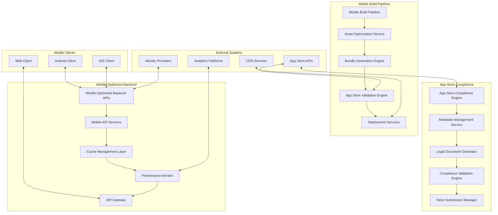
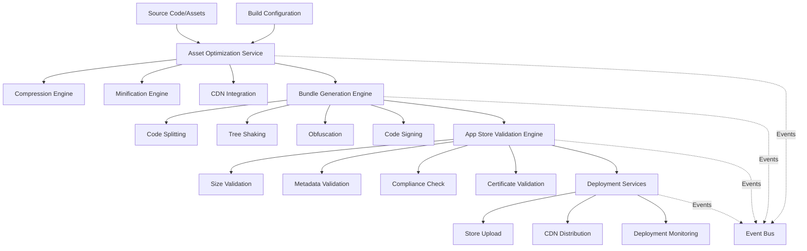
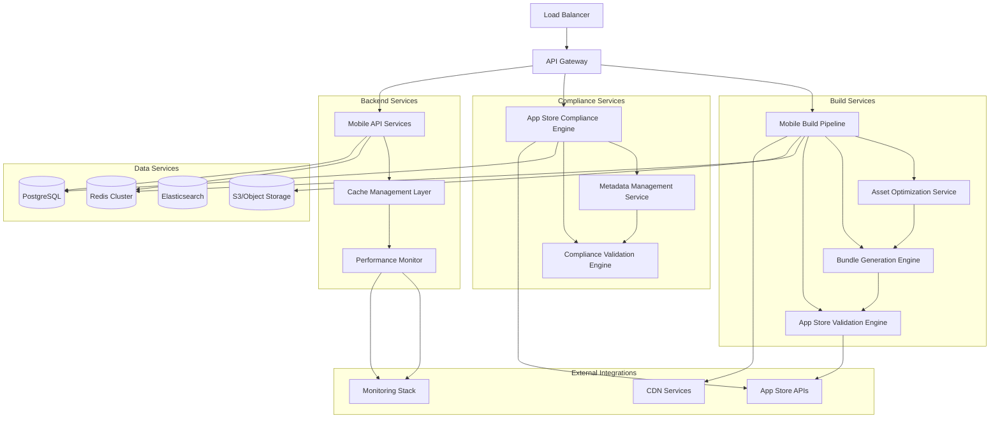
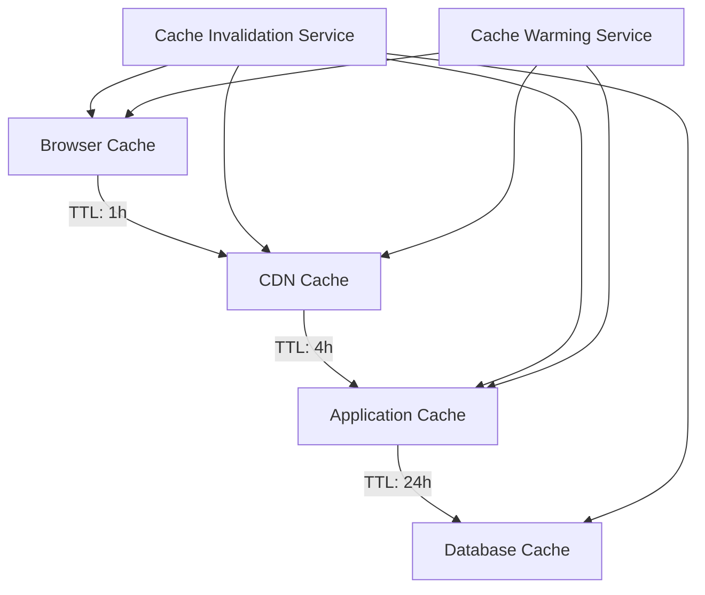

# Mobile-Optimized Build Pipeline Architecture

## Overview

This document outlines the comprehensive architecture for a mobile-optimized build pipeline system designed to achieve 30%+ bundle size reduction, automated App Store compliance validation, and <200ms mobile API response times.

## System Architecture

### Core Principles

- **Mobile-First Design**: All components optimized for mobile constraints and performance requirements
- **Event-Driven Architecture**: Async messaging between services for loose coupling
- **Security-First**: End-to-end encryption with compliance validation at every layer
- **Scalability**: Horizontal scaling support across multiple mobile platforms and App Store environments

### Technology Stack

- **Mobile Platforms**: iOS 12+, Android 8+
- **Build Tools**: Unity Build Pipeline, Fastlane, custom optimization scripts
- **Backend**: Node.js/TypeScript microservices with Redis caching
- **Infrastructure**: Kubernetes with Istio service mesh
- **Security**: Certificate pinning, secure storage, compliance validation
- **Monitoring**: Prometheus, Grafana, Jaeger tracing

## 1. System Context Diagram



## 2. Component Interaction Diagram

### Mobile Build Pipeline Components



## 3. Service Boundary Definitions

### 3.1 Mobile Build Pipeline Service

**Responsibility**: Orchestrates the entire mobile build process from source to App Store deployment

**Key Interfaces**:
- **Build Configuration API**: Defines build parameters and optimization settings
- **Asset Processing API**: Handles asset optimization and bundling
- **Validation API**: Performs App Store compliance checks
- **Deployment API**: Manages store submissions and distribution

**Data Ownership**:
- Build configurations and metadata
- Build artifacts and optimization results
- Deployment status and analytics

**Service-Level Objectives**:
- Build completion: <10 minutes for incremental builds
- Success rate: >95% for automated builds
- Bundle size reduction: >30% from baseline

### 3.2 Asset Optimization Service

**Responsibility**: Optimizes mobile assets for size and performance while maintaining quality

**Key Functions**:
- Image compression and format optimization
- Audio compression and streaming optimization
- 3D model optimization and LOD generation
- Texture atlas generation and compression

**Interfaces**:
```typescript
interface AssetOptimizationService {
  optimizeAssets(request: AssetOptimizationRequest): Promise<AssetOptimizationResult>
  validateAssetCompatibility(assets: AssetBundle[]): Promise<ValidationResult>
  generateOptimizationReport(buildId: string): Promise<OptimizationReport>
}
```

### 3.3 Bundle Generation Engine

**Responsibility**: Creates optimized application bundles for iOS and Android platforms

**Key Features**:
- Platform-specific code splitting
- Dead code elimination
- Asset bundling and dependency resolution
- App Store package generation

### 3.4 App Store Validation Engine

**Responsibility**: Validates builds against App Store requirements and guidelines

**Validation Categories**:
- Size and performance requirements
- Metadata and asset compliance
- Security and privacy guidelines
- Platform-specific restrictions

## 4. Interface Specifications

### 4.1 Build Pipeline API

```typescript
interface BuildPipelineAPI {
  // Build lifecycle management
  startBuild(request: BuildRequest): Promise<BuildResponse>
  getBuildStatus(buildId: string): Promise<BuildStatus>
  cancelBuild(buildId: string): Promise<void>

  // Configuration management
  updateBuildConfig(config: BuildConfiguration): Promise<void>
  validateConfig(config: BuildConfiguration): Promise<ValidationResult>

  // Asset management
  uploadAssets(assets: AssetBundle[]): Promise<UploadResult>
  optimizeAssets(request: OptimizationRequest): Promise<OptimizationResult>
}
```

### 4.2 Compliance Engine API

```typescript
interface ComplianceEngineAPI {
  // Compliance validation
  validateCompliance(buildId: string): Promise<ComplianceReport>
  checkMetadataCompliance(metadata: AppMetadata): Promise<MetadataValidation>

  // Legal document management
  generateLegalDocuments(locale: string): Promise<LegalDocument[]>
  validateLegalCompliance(documents: LegalDocument[]): Promise<ComplianceResult>

  // Store submission
  prepareStoreSubmission(request: SubmissionRequest): Promise<SubmissionPackage>
  validateSubmissionPackage(package: SubmissionPackage): Promise<ValidationResult>
}
```

### 4.3 Mobile API Services

```typescript
interface MobileAPIServices {
  // Performance-optimized endpoints
  getUserData(userId: string, options?: CacheOptions): Promise<UserData>
  syncGameState(state: GameState, options?: SyncOptions): Promise<SyncResult>
  getLeaderboardData(region: string): Promise<LeaderboardResponse>

  // Caching interfaces
  invalidateUserCache(userId: string): Promise<void>
  refreshCache(pattern: string): Promise<void>

  // Real-time features
  subscribeToUpdates(userId: string): Promise<Subscription>
  publishUpdate(update: DataUpdate): Promise<void>
}
```

## 5. Deployment Architecture

### 5.1 Infrastructure Overview



### 5.2 Deployment Strategy

- **Blue-Green Deployments**: Zero-downtime updates for all services
- **Canary Releases**: Gradual rollout of new features
- **Horizontal Pod Autoscaling**: Automatic scaling based on demand
- **Multi-Region Deployment**: Global distribution with region-specific optimization

### 5.3 Environment Configuration

```yaml
# Environment-specific configuration
environments:
  development:
    build_optimization: false
    compliance_validation: false
    caching: disabled
    monitoring: basic

  staging:
    build_optimization: true
    compliance_validation: true
    caching: enabled
    monitoring: enhanced

  production:
    build_optimization: true
    compliance_validation: true
    caching: enabled
    monitoring: full
    security: enhanced
```

## 6. Security Architecture Integration

### 6.1 End-to-End Security

```mermaid
graph TD
    %% Security layers
    SEC_L1[Transport Security]
    SEC_L2[Application Security]
    SEC_L3[Data Security]
    SEC_L4[Infrastructure Security]

    %% Transport layer
    SEC_L1_TLS[TLS 1.3]
    SEC_L1_CERT[Certificate Pinning]
    SEC_L1_HSTS[HSTS Headers]

    %% Application layer
    SEC_L2_AUTH[JWT Authentication]
    SEC_L2_AUTHZ[RBAC Authorization]
    SEC_L2_INPUT[Input Validation]
    SEC_L2_CSRF[CSRF Protection]

    %% Data layer
    SEC_L3_ENC[Data Encryption]
    SEC_L3_HASH[Secure Hashing]
    SEC_L3_STORAGE[Secure Storage]
    SEC_L3_TRANSMIT[Secure Transmission]

    %% Infrastructure layer
    SEC_L4_NET[Network Security]
    SEC_L4_ACCESS[Access Control]
    SEC_L4_MON[Security Monitoring]
    SEC_L4_AUDIT[Audit Logging]

    %% Implementation flow
    SEC_L1 --> SEC_L1_TLS
    SEC_L1 --> SEC_L1_CERT
    SEC_L1 --> SEC_L1_HSTS

    SEC_L2 --> SEC_L2_AUTH
    SEC_L2 --> SEC_L2_AUTHZ
    SEC_L2 --> SEC_L2_INPUT
    SEC_L2 --> SEC_L2_CSRF

    SEC_L3 --> SEC_L3_ENC
    SEC_L3 --> SEC_L3_HASH
    SEC_L3 --> SEC_L3_STORAGE
    SEC_L3 --> SEC_L3_TRANSMIT

    SEC_L4 --> SEC_L4_NET
    SEC_L4 --> SEC_L4_ACCESS
    SEC_L4 --> SEC_L4_MON
    SEC_L4 --> SEC_L4_AUDIT
```



### 6.2 Compliance Validation Integration

- **App Store Guidelines**: Automated validation against current App Store requirements
- **Privacy Regulations**: GDPR, CCPA compliance validation
- **Security Standards**: OWASP Mobile Top 10 compliance
- **Legal Requirements**: Age ratings, content warnings, accessibility compliance

### 6.3 Certificate and Key Management

```typescript
interface CertificateManager {
  // Certificate lifecycle
  generateSigningCertificate(request: CertificateRequest): Promise<Certificate>
  rotateSigningCertificate(certId: string): Promise<CertificateRotation>
  revokeCertificate(certId: string): Promise<void>

  // Key management
  encryptSensitiveData(data: SensitiveData): Promise<EncryptedData>
  decryptSensitiveData(encryptedData: EncryptedData): Promise<SensitiveData>
  rotateEncryptionKeys(): Promise<KeyRotationResult>
}
```

## 7. Performance Optimization Architecture

### 7.1 Multi-Layer Caching Strategy



### 7.2 Network-Aware Performance

- **Connection Quality Detection**: Automatic quality adjustment based on network conditions
- **Offline-First Architecture**: Critical features work without network connectivity
- **Predictive Prefetching**: Intelligent resource loading based on user behavior
- **Compression Optimization**: Platform-specific compression algorithms

## 8. Monitoring and Observability

### 8.1 Key Performance Indicators

- **Build Performance**: Build time, success rate, bundle size metrics
- **API Performance**: Response time, throughput, error rate
- **User Experience**: App launch time, frame rate, crash rate
- **Compliance**: Validation success rate, submission success rate

### 8.2 Alerting Strategy

```yaml
alerts:
  critical:
    - build_failure_rate: ">5%"
    - api_response_time: ">500ms"
    - app_crash_rate: ">1%"

  warning:
    - bundle_size_increase: ">10%"
    - compliance_validation_failure: ">2%"
    - cache_hit_ratio: "<85%"
```

## Conclusion

This architecture provides a comprehensive foundation for mobile build optimization with clear service boundaries, robust security integration, and scalable performance optimization. The modular design enables independent scaling of components while maintaining strong consistency guarantees across the entire pipeline.

**Next Steps**:
1. Implement core build pipeline services
2. Develop asset optimization algorithms
3. Create compliance validation framework
4. Establish monitoring and alerting infrastructure
5. Conduct performance testing and optimization