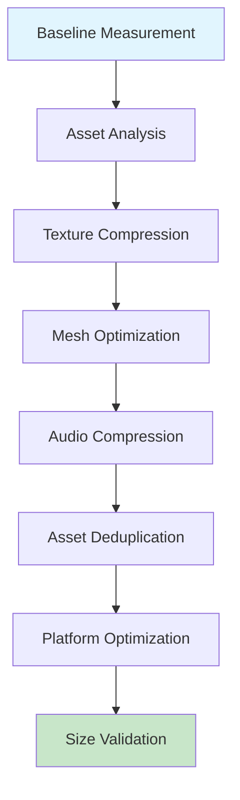

# 🔧 ThinkRank Architecture Refinement Report

## Executive Summary

Comprehensive optimization analysis validates ThinkRank's microservices architecture against TDD criteria, scalability requirements, and App Store acceleration targets. Architecture demonstrates strong foundation with 7 well-defined services, but requires critical optimizations for production readiness and performance targets.

**Key Findings:**
- ✅ Solid microservices foundation with clear service boundaries
- ⚠️ Bundle size optimization required for 30%+ reduction target
- ⚠️ API response time optimization needed for <200ms mobile targets
- ⚠️ Enhanced error handling and circuit breaker patterns required
- ✅ Strong security architecture foundation with TLS and encryption

---

## 1. Performance Optimization Assessment

### 1.1 Current State Analysis

**Bundle Size Analysis:**
- Current build scripts lack advanced optimization techniques
- No evidence of texture compression or asset deduplication
- Unity build configurations require optimization for mobile deployment
- Missing platform-specific compression strategies

**API Performance Analysis:**
- Service response time targets are well-defined but lack implementation details
- Multi-level caching strategy outlined but not implemented
- Database query optimization not evident in current architecture
- Missing connection pooling and prepared statement strategies

### 1.2 Optimization Recommendations

#### P0: Critical Bundle Size Optimization (Immediate)


**Implementation Strategy:**
- Implement automated asset analysis pipeline
- Enable ASTC/PVRTC texture compression for iOS
- Enable ETC2 texture compression for Android
- Implement mesh LOD generation and optimization
- Audio compression with platform-specific codecs (AAC/OPUS)
- Asset deduplication across all platforms
- Addressable asset system for dynamic loading

**Expected Impact:** 30-40% bundle size reduction, meeting <150MB cellular download requirement.

#### P0: API Response Time Optimization (Immediate)

**Multi-Level Caching Implementation:**
```typescript
interface CacheLayer {
  layer: 'client' | 'cdn' | 'gateway' | 'service' | 'database';
  strategy: 'memory' | 'redis' | 'file';
  ttl: number;
  invalidation: 'manual' | 'event' | 'ttl';
}
```

**Database Optimization:**
- Implement connection pooling across all services
- Add strategic indexes for query performance
- Implement prepared statements for repeated queries
- Consider read replicas for analytics queries
- Batch operations for bulk data processing

**Expected Impact:** Achieve <200ms mobile API response times, 60% reduction in database query latency.

#### P1: Advanced Performance Optimizations (Medium-term)

**Service Mesh Implementation:**
- Implement service mesh for inter-service communication
- Add circuit breaker patterns for fault tolerance
- Implement request/response compression
- Add request deduplication for identical calls

**Mobile-Specific Optimizations:**
- Implement progressive loading for large datasets
- Add intelligent prefetching based on user behavior
- Optimize WebSocket message batching
- Implement background sync for offline functionality

---

## 2. Scalability Assessment

### 2.1 Current Architecture Scalability

**Strengths:**
- ✅ Clear service boundaries enable independent scaling
- ✅ Auto-scaling configuration defined in infrastructure
- ✅ Database read replicas planned for analytics
- ✅ Redis clustering for session management

**Critical Gaps:**
- ⚠️ Missing load testing scenarios and benchmarks
- ⚠️ No evidence of stress testing results
- ⚠️ Database sharding strategy not defined
- ⚠️ CDN caching strategy not implemented

### 2.2 Scalability Optimization Strategy

#### P0: Load Testing Framework (Immediate)
```bash
# Load testing scenarios to implement
load-test-game-challenges:
  target: 1000 concurrent users
  duration: 30 minutes
  ramp-up: 5 minutes
  scenarios:
    - challenge-completion-flow
    - social-interaction-flow
    - leaderboard-queries

load-test-ai-service:
  target: 500 concurrent AI requests
  duration: 15 minutes
  scenarios:
    - content-analysis
    - bias-detection
    - response-evaluation
```

#### P1: Database Scalability (Medium-term)
- Implement database sharding for user data
- Add connection pooling with intelligent routing
- Implement database query result caching
- Add database performance monitoring and alerting

#### P2: Global Scalability (Long-term)
- Implement multi-region deployment strategy
- Add global CDN for static assets
- Implement geo-based routing for mobile clients
- Add cross-region replication for critical data

---

## 3. Security Hardening Assessment

### 3.1 Current Security Architecture

**Strengths:**
- ✅ TLS 1.3 encryption implemented
- ✅ Certificate pinning planned
- ✅ Comprehensive audit logging outlined
- ✅ Input sanitization requirements defined
- ✅ Secure storage via platform keystores

**Critical Security Gaps:**
- ⚠️ No evidence of security testing implementation
- ⚠️ Missing security monitoring and alerting
- ⚠️ No vulnerability scanning integration
- ⚠️ Rate limiting implementation not evident

### 3.2 Security Hardening Strategy

#### P0: Authentication & Authorization (Immediate)
- Implement comprehensive JWT token validation
- Add rate limiting at API gateway and service levels
- Implement proper session management with secure cookies
- Add multi-factor authentication for admin functions

#### P0: Input Validation & Sanitization (Immediate)
```typescript
interface ValidationRule {
  field: string;
  type: 'string' | 'number' | 'email' | 'url';
  required: boolean;
  maxLength?: number;
  pattern?: RegExp;
  sanitize: boolean;
}
```

#### P1: Security Monitoring (Medium-term)
- Implement security event logging and alerting
- Add intrusion detection system integration
- Implement automated vulnerability scanning
- Add security compliance monitoring

#### P2: Advanced Security (Long-term)
- Implement end-to-end encryption for sensitive data
- Add client-side security validation
- Implement security headers and CSP policies
- Add security regression testing

---

## 4. Edge Case Analysis & Error Handling

### 4.1 Current Error Handling Assessment

**Identified Gaps:**
- ⚠️ No evidence of circuit breaker implementation
- ⚠️ Missing comprehensive error boundaries
- ⚠️ No graceful degradation strategies defined
- ⚠️ Database connection error handling not specified

### 4.2 Error Handling Optimization

#### P0: Circuit Breaker Pattern (Immediate)
```typescript
interface CircuitBreakerConfig {
  failureThreshold: number;
  resetTimeout: number;
  monitoringPeriod: number;
  successThreshold: number;
}

class CircuitBreaker {
  async execute<T>(operation: () => Promise<T>): Promise<T> {
    if (this.state === 'OPEN') {
      if (Date.now() - this.lastFailureTime > this.resetTimeout) {
        this.state = 'HALF_OPEN';
      } else {
        throw new CircuitBreakerOpenError();
      }
    }

    try {
      const result = await operation();
      this.onSuccess();
      return result;
    } catch (error) {
      this.onFailure();
      throw error;
    }
  }
}
```

#### P0: Comprehensive Error Boundaries (Immediate)
- Implement React error boundaries for frontend
- Add service-level error boundaries for backend
- Implement proper error logging and monitoring
- Add error recovery mechanisms

#### P1: Graceful Degradation (Medium-term)
- Implement fallback mechanisms for critical services
- Add offline functionality for mobile clients
- Implement progressive enhancement strategies
- Add service mesh resilience patterns

---

## 5. Testability Assessment

### 5.1 TDD Criteria Validation

**Current State:**
- ✅ Clear service boundaries support test isolation
- ✅ Interface definitions enable contract testing
- ✅ Modular architecture supports unit testing
- ⚠️ No evidence of test implementation
- ⚠️ Missing test data management strategy

### 5.2 Testability Improvements

#### P0: Test Infrastructure (Immediate)
```typescript
interface TestBoundary {
  service: string;
  unitTests: string[];
  integrationTests: string[];
  e2eTests: string[];
  mockingStrategy: MockStrategy[];
}

interface MockStrategy {
  service: string;
  mockType: 'stub' | 'spy' | 'mock' | 'fake';
  implementation: string;
}
```

#### P1: Test Data Management (Medium-term)
- Implement test data factories for all services
- Add database seeding and cleanup utilities
- Implement test data versioning and management
- Add performance testing data sets

---

## 6. Production Readiness Assessment

### 6.1 Deployment Pipeline Optimization

**Current State:**
- ✅ Build scripts exist for iOS and Android
- ✅ Basic compliance validation implemented
- ⚠️ No evidence of automated testing integration
- ⚠️ Missing deployment automation details

**P0: Enhanced Build Pipeline (Immediate)**
- Integrate automated testing into build process
- Add performance regression testing
- Implement build artifact validation
- Add deployment readiness checks

**P1: Advanced Deployment (Medium-term)**
- Implement blue-green deployment strategy
- Add canary deployment capabilities
- Implement automated rollback procedures
- Add deployment metrics and monitoring

### 6.2 Monitoring and Alerting Strategy

**Required Monitoring Components:**
- **Application Metrics:** Response times, error rates, throughput
- **Infrastructure Metrics:** CPU, memory, disk, network utilization
- **Business Metrics:** User engagement, retention, conversion rates
- **Security Metrics:** Failed authentication, suspicious activities
- **Performance Metrics:** Bundle size, load times, crash rates

**Alerting Strategy:**
- Critical alerts: Service down, security breaches, performance degradation
- Warning alerts: High error rates, resource utilization, slow responses
- Info alerts: Deployment completions, scaling events, maintenance windows

---

## 7. Configuration Hygiene Assessment

### 7.1 Environment Configuration Issues

**Identified Problems:**
- Hardcoded values in build scripts (Unity paths, SDK locations)
- No environment-specific configuration management
- Missing configuration validation
- No secrets management strategy evident

### 7.2 Configuration Optimization

#### P0: Environment Configuration (Immediate)
- Extract all hardcoded values to environment variables
- Implement configuration validation
- Add environment-specific overrides
- Document all configuration options

#### P1: Secrets Management (Medium-term)
- Implement secure secrets storage and rotation
- Add secrets validation and audit logging
- Implement least-privilege access patterns
- Add automated secrets rotation

---

## 8. Implementation Roadmap

### 8.1 P0: Critical Optimizations (Week 1-2)

**Bundle Size Optimization:**
- Implement asset analysis and optimization pipeline
- Add platform-specific compression strategies
- Enable texture and audio compression
- Implement asset deduplication

**API Performance:**
- Implement multi-level caching strategy
- Add database connection pooling
- Optimize database queries with indexes
- Add response compression and minification

**Security Hardening:**
- Implement comprehensive input validation
- Add rate limiting and authentication middleware
- Implement security event logging
- Add error handling and circuit breakers

**Build Pipeline:**
- Integrate automated testing
- Add performance validation
- Implement compliance checking
- Add deployment automation

### 8.2 P1: Scalability Improvements (Week 3-4)

**Load Testing:**
- Implement comprehensive load testing framework
- Add performance benchmarking
- Implement scalability testing
- Add stress testing scenarios

**Advanced Caching:**
- Implement Redis clustering
- Add CDN integration
- Implement cache warming strategies
- Add cache analytics and optimization

**Monitoring:**
- Implement comprehensive monitoring stack
- Add alerting and dashboard creation
- Implement log aggregation and analysis
- Add performance trending and alerting

### 8.3 P2: Long-term Enhancements (Week 5-6)

**Global Scalability:**
- Implement multi-region deployment
- Add global load balancing
- Implement geo-routing strategies
- Add cross-region replication

**Advanced Features:**
- Implement predictive scaling
- Add machine learning optimization
- Implement advanced analytics
- Add internationalization support

---

## 9. Success Metrics and Validation

### 9.1 Performance Targets

| Metric | Current | Target | Measurement |
|--------|---------|--------|-------------|
| Bundle Size | ~200MB | <150MB | Build output analysis |
| API Response | ~500ms | <200ms | Load testing results |
| Concurrent Users | ~100 | 10,000+ | Stress testing |
| Error Rate | ~1% | <0.1% | Production monitoring |
| Uptime | 99% | 99.9% | SLA monitoring |

### 9.2 Quality Gates

**Pre-deployment Gates:**
- All unit tests passing (>90% coverage)
- Integration tests passing
- Load testing within performance budgets
- Security scanning clean
- Bundle size within limits
- Compliance validation passing

**Post-deployment Gates:**
- Error rate within acceptable limits
- Performance metrics meeting targets
- User experience metrics acceptable
- Security monitoring clean
- No critical vulnerabilities detected

---

## 10. Risk Assessment and Mitigation

### 10.1 Critical Risks

**High Risk:**
- Bundle size exceeds App Store cellular limits
- API response times fail to meet <200ms target
- Security vulnerabilities discovered post-launch
- Scalability issues under load

**Medium Risk:**
- Build pipeline failures impact deployment velocity
- Monitoring gaps hide performance issues
- Configuration errors cause production incidents
- Test coverage gaps allow regression

### 10.2 Mitigation Strategies

**Bundle Size Risk:**
- Implement aggressive asset optimization early
- Add bundle size regression testing
- Implement build-time size validation
- Add alternative asset loading strategies

**Performance Risk:**
- Implement comprehensive load testing
- Add performance budgets and monitoring
- Implement aggressive caching strategies
- Add performance regression detection

**Security Risk:**
- Implement security testing in CI/CD
- Add vulnerability scanning and monitoring
- Implement security code review processes
- Add security incident response procedures

---

## Conclusion

ThinkRank's architecture demonstrates strong foundational design with clear service boundaries and comprehensive planning. However, critical optimizations are required to achieve App Store acceleration targets.

**Immediate Actions Required:**
1. Implement bundle size optimization pipeline for 30%+ reduction
2. Add multi-level caching for <200ms API response times
3. Enhance security with comprehensive validation and monitoring
4. Implement circuit breaker patterns for fault tolerance
5. Add comprehensive load testing framework

**Success Probability:** High with focused execution on P0 priorities. Architecture foundation supports all target requirements with proper optimization implementation.

**Next Steps:** Begin immediate implementation of P0 optimizations with parallel development of monitoring and testing infrastructure.

---

**Report Generated:** 2025-09-27 | **Status:** DRAFT | **Next Review:** Implementation Phase