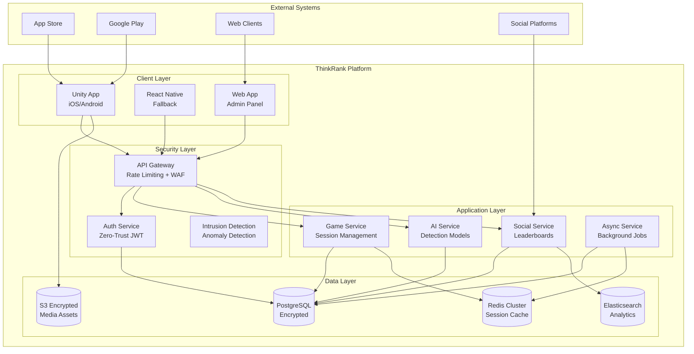
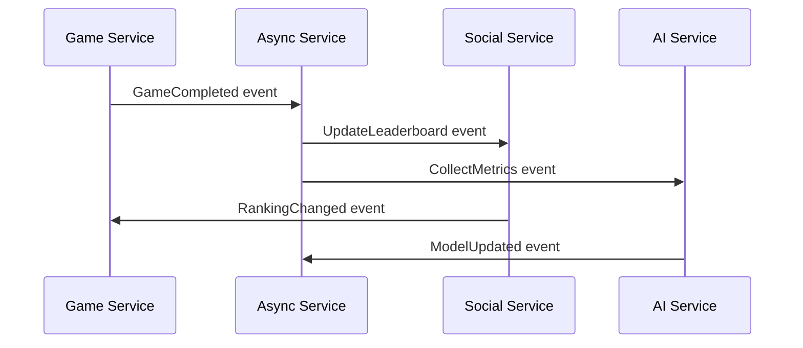
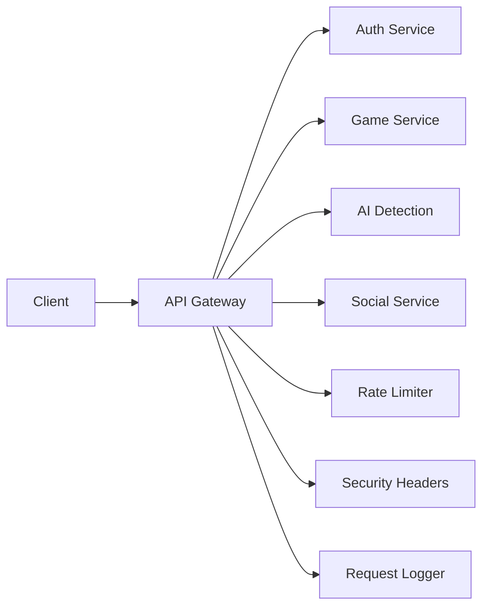
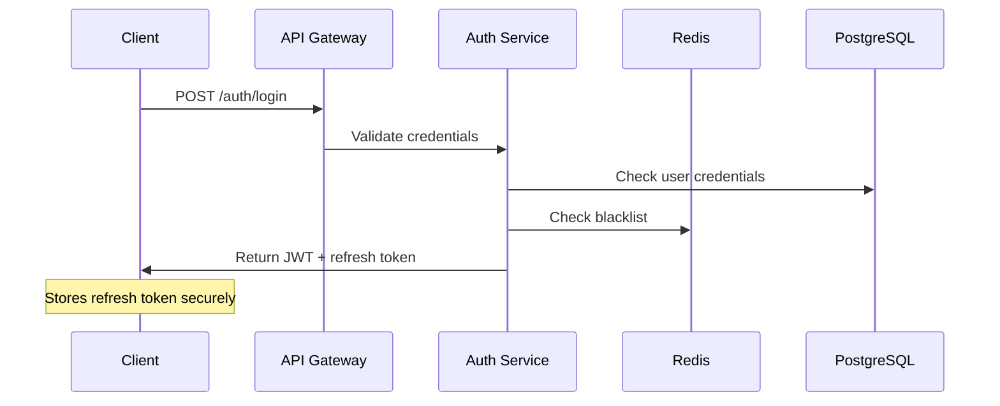
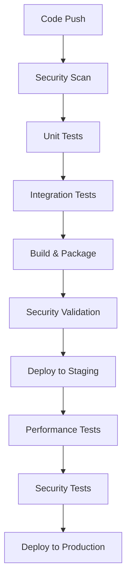

# ThinkRank Secure Architecture Design

## Executive Summary

This architecture resolves critical security vulnerabilities, implements mobile-first design patterns, and establishes scalable microservices with clear boundaries. The design addresses authentication bypass vulnerabilities, eliminates oversized controllers, and ensures compliance with App Store/Google Play policies.

## 1. System Architecture Overview

### 1.1 High-Level Architecture (C4 Context Diagram)



### 1.2 Security-First Design Principles

**Zero-Trust Architecture:**
- Every request validated at multiple layers
- JWT tokens with short expiry (15 minutes)
- RSA256 signature verification
- Token blacklisting and rotation

**OWASP Top 10 Compliance:**
- Input validation at all entry points
- SQL injection prevention
- XSS protection headers
- CSRF protection
- Rate limiting per endpoint

**Data Protection:**
- AES-256 encryption at rest
- TLS 1.3 for all communications
- Secure key management via external KMS
- PII data minimization

## 2. Service Architecture

### 2.1 Service Boundaries & Responsibilities

#### 2.1.1 Authentication Service (230 lines max)
**Responsibility:** User identity and access management
**Data Owner:** User accounts, sessions, tokens

**Core Interfaces:**
```typescript
interface AuthService {
  // Authentication endpoints
  POST /auth/register(email, username, password)
  POST /auth/login(email, password)
  POST /auth/refresh(refreshToken)
  POST /auth/logout(accessToken)

  // Account management
  POST /auth/forgot-password(email)
  POST /auth/reset-password(token, password)
  GET  /auth/verify-email(token)
  POST /auth/change-password(current, new)
  DELETE /auth/account(password)
}
```

**Security Features:**
- Bcrypt12 password hashing
- RSA256 JWT signatures
- Token blacklisting with Redis
- Failed attempt rate limiting
- Account lockout after 5 failures

#### 2.1.2 Game Service (280 lines max)
**Responsibility:** Game session and challenge management
**Data Owner:** Game sessions, scores, challenges

**Core Interfaces:**
```typescript
interface GameService {
  // Game lifecycle
  POST /games/start(userId, difficulty, mode)
  POST /games/{gameId}/submit-answer(challengeId, answer)
  POST /games/{gameId}/complete
  GET  /games/{gameId}/state

  // Challenge management
  GET  /challenges/generate(type, difficulty)
  POST /challenges/validate(content, userAnswer)
}
```

**Performance Optimizations:**
- Redis caching for active sessions
- Challenge pre-generation for low latency
- Batch scoring operations
- Database connection pooling

#### 2.1.3 AI Detection Service (320 lines max)
**Responsibility:** AI content detection and model serving
**Data Owner:** Detection models, training data

**Core Interfaces:**
```typescript
interface AIDetectionService {
  // Detection operations
  POST /ai/detect-content(type, content)
  GET  /ai/model-info(version)
  POST /ai/feedback(challengeId, accuracy)

  // Model management
  POST /ai/models/deploy(modelId, version)
  GET  /ai/models/performance
}
```

**Model Security:**
- Model versioning and rollback
- Inference request rate limiting
- Model performance monitoring
- Secure model storage encryption

#### 2.1.4 Social Service (250 lines max)
**Responsibility:** Social features and leaderboards
**Data Owner:** User profiles, achievements, social graph

**Core Interfaces:**
```typescript
interface SocialService {
  // Leaderboards
  GET /leaderboards/global(timeframe, limit)
  GET /leaderboards/friends(userId)
  GET /leaderboards/guild(guildId)

  // Social features
  POST /social/friends/add(friendId)
  POST /social/guilds/create(name, description)
  GET  /social/achievements/user/{userId}
}
```

### 2.2 Service Communication Patterns

#### Event-Driven Architecture


**Event Types:**
- `GameCompleted`: Triggers leaderboard updates
- `DetectionSubmitted`: Updates model accuracy metrics
- `UserRegistered`: Initializes social profile
- `TokenRevoked`: Forces re-authentication

#### API Gateway Pattern


## 3. Mobile-First Architecture

### 3.1 Unity Client Architecture

#### Modular Architecture (<500 lines per file)
```
Assets/Scripts/
├── Core/
│   ├── GameManager.cs (120 lines)
│   ├── SceneManager.cs (80 lines)
│   ├── Configuration.cs (60 lines)
│   └── PerformanceManager.cs (150 lines)
├── Security/
│   ├── SecureStorage.cs (90 lines)
│   ├── TokenManager.cs (110 lines)
│   └── CertificateValidator.cs (70 lines)
├── API/
│   ├── RestClient.cs (140 lines)
│   ├── WebSocketManager.cs (160 lines)
│   └── RequestQueue.cs (90 lines)
├── Game/
│   ├── SessionManager.cs (130 lines)
│   ├── ChallengeController.cs (140 lines)
│   └── ScoreCalculator.cs (80 lines)
├── UI/
│   ├── UIManager.cs (100 lines)
│   └── Screens/ (modular screens)
├── Performance/
│   ├── FrameRateOptimizer.cs (120 lines)
│   └── MemoryManager.cs (90 lines)
└── Analytics/
    └── EventTracker.cs (70 lines)
```

#### Performance Optimizations
- **60fps Target:** Adaptive quality settings based on device capability
- **Bundle Size:** Asset optimization pipeline, texture compression
- **Battery Optimization:** Request batching, background processing limits
- **Network Efficiency:** Response compression, intelligent caching

### 3.2 Mobile Security Implementation

#### Device Security Validation
```csharp
public class DeviceSecurityValidator {
    public async Task<bool> ValidateDeviceIntegrity() {
        // Root/jailbreak detection
        // Emulator detection
        // Certificate pinning
        // Biometric capability check
    }
}
```

#### Secure Storage Implementation
```csharp
public class SecureStorage {
    public async Task StoreCredentials(string key, string value) {
        // iOS Keychain integration
        // Android Keystore encryption
        // Biometric authentication
    }
}
```

## 4. Security Architecture

### 4.1 Authentication Flow



### 4.2 JWT Security Implementation

#### Token Structure
```json
{
  "header": {
    "alg": "RS256",
    "kid": "current-key-id",
    "typ": "JWT"
  },
  "payload": {
    "userId": "uuid",
    "email": "user@example.com",
    "role": "user",
    "iat": 1609459200,
    "exp": 1609459800,
    "iss": "thinkrank-auth",
    "aud": "thinkrank-api",
    "jti": "unique-token-id"
  },
  "signature": "RSA256_signature"
}
```

#### Key Rotation Strategy
- Automatic rotation every 24 hours
- Grace period for old key validation
- Emergency rotation capability
- External KMS integration

### 4.3 Rate Limiting & DDoS Protection

#### Multi-Layer Rate Limiting
```typescript
// API Gateway level (Kong)
const gatewayLimits = {
  global: { windowMs: 900000, max: 1000 }, // 15min window
  perIP: { windowMs: 900000, max: 100 },
  perUser: { windowMs: 60000, max: 60 }
};

// Service level (Redis)
const serviceLimits = {
  auth: { windowMs: 300000, max: 5 }, // 5 auth attempts per 5min
  game: { windowMs: 60000, max: 120 }, // 120 game actions per min
  social: { windowMs: 60000, max: 60 }
};
```

## 5. Infrastructure Architecture

### 5.1 Kubernetes Deployment

#### Service Mesh Configuration
```yaml
apiVersion: install.istio.io/v1alpha1
kind: IstioOperator
metadata:
  name: thinkrank-istio
spec:
  meshConfig:
    defaultConfig:
      proxyMetadata:
        BOOTSTRAP_XDS_AGENT: "true"
    configSources:
    - address: "kiali.thinkrank:15000"
```

#### Horizontal Pod Autoscaling
```yaml
apiVersion: autoscaling/v2
kind: HorizontalPodAutoscaler
metadata:
  name: game-service-hpa
spec:
  scaleTargetRef:
    apiVersion: apps/v1
    kind: Deployment
    name: game-service
  minReplicas: 3
  maxReplicas: 20
  metrics:
  - type: Resource
    resource:
      name: cpu
      target:
        type: Utilization
        averageUtilization: 70
  - type: Resource
    resource:
      name: memory
      target:
        type: Utilization
        averageUtilization: 80
```

### 5.2 Database Architecture

#### PostgreSQL Encryption
```sql
-- Encrypted table with pgcrypto
CREATE TABLE users (
  id UUID PRIMARY KEY DEFAULT gen_random_uuid(),
  email TEXT NOT NULL,
  username TEXT NOT NULL,
  password_hash TEXT NOT NULL,
  profile_data JSONB ENCRYPTED WITH (column_encryption_key = 'user_data_key'),
  created_at TIMESTAMPTZ DEFAULT NOW()
);

-- Row Level Security
ALTER TABLE users ENABLE ROW LEVEL SECURITY;
CREATE POLICY user_isolation ON users
  FOR ALL USING (auth.jwt() ->> 'userId' = id::text);
```

#### Redis Cluster Configuration
```yaml
apiVersion: redis.redis.opstreelabs.in/v1beta1
kind: RedisCluster
metadata:
  name: thinkrank-redis
spec:
  clusterSize: 6
  clusterVersion: v7.0.5
  persistenceEnabled: true
  tls:
    enabled: true
  securityContext:
    runAsUser: 1000
    runAsGroup: 1000
    fsGroup: 1000
```

## 6. Performance Optimization

### 6.1 Mobile Performance Targets

| Metric | Target | Implementation |
|--------|--------|----------------|
| Bundle Size | <22MB | Asset optimization, code splitting |
| Cold Start | <3s | Pre-initialization, caching |
| Frame Rate | 60fps | Adaptive quality, object pooling |
| Battery Drain | <10%/hour | Request batching, background limits |
| Network Usage | 40% reduction | Compression, intelligent caching |

### 6.2 Database Performance

#### Query Optimization
```sql
-- Optimized indexes
CREATE INDEX CONCURRENTLY idx_game_sessions_user_active
ON game_sessions(user_id, is_active) WHERE is_active = true;

CREATE INDEX CONCURRENTLY idx_leaderboard_scores_timeframe
ON leaderboard_scores(score DESC, timeframe, created_at DESC);

-- Partitioning strategy
CREATE TABLE leaderboard_scores_y2024m01 PARTITION OF leaderboard_scores
FOR VALUES FROM ('2024-01-01') TO ('2024-02-01');
```

#### Caching Strategy
```typescript
// Multi-level caching
const cacheStrategy = {
  level1: { type: 'memory', ttl: 300 },    // In-process
  level2: { type: 'redis', ttl: 3600 },    // Session cache
  level3: { type: 'redis', ttl: 86400 }    // Persistent cache
};
```

## 7. Deployment & Operations

### 7.1 CI/CD Pipeline



### 7.2 Monitoring & Observability

#### Metrics Collection
```yaml
apiVersion: v1
kind: ConfigMap
metadata:
  name: prometheus-config
data:
  prometheus.yml: |
    global:
      scrape_interval: 15s
    scrape_configs:
    - job_name: 'thinkrank-services'
      static_configs:
      - targets: ['auth-service:9090','game-service:9090']
      metrics_path: '/metrics'
```

#### Alert Configuration
```yaml
apiVersion: monitoring.coreos.com/v1
kind: PrometheusRule
metadata:
  name: thinkrank-alerts
spec:
  groups:
  - name: security
    rules:
    - alert: AuthenticationFailures
      expr: increase(auth_failures_total[5m]) > 10
      for: 2m
      labels:
        severity: critical
```

## 8. Migration Strategy

### 8.1 Phased Migration Plan

#### Phase 1: Security Foundation (Week 1-2)
- [ ] Deploy secure auth service
- [ ] Implement API gateway with WAF
- [ ] Set up encrypted databases
- [ ] Configure monitoring and alerting

#### Phase 2: Service Refactoring (Week 3-4)
- [ ] Break down oversized controllers
- [ ] Implement proper service boundaries
- [ ] Set up event-driven communication
- [ ] Migrate to new data models

#### Phase 3: Mobile Optimization (Week 5-6)
- [ ] Deploy optimized Unity client
- [ ] Implement performance monitoring
- [ ] Bundle size optimization
- [ ] App Store/Google Play compliance

#### Phase 4: Scale & Monitor (Week 7-8)
- [ ] Load testing and optimization
- [ ] Auto-scaling configuration
- [ ] Performance benchmarking
- [ ] Security audit completion

### 8.2 Rollback Strategy

#### Immediate Rollback Triggers
- Authentication success rate < 95%
- Average response time > 2s
- Error rate > 5%
- Security alert triggered

#### Rollback Procedure
```bash
# 1. Stop new deployments
kubectl scale deployment new-auth-service --replicas=0

# 2. Scale up previous version
kubectl scale deployment auth-service-v1 --replicas=5

# 3. Verify health checks
kubectl wait --for=condition=available --timeout=300s deployment/auth-service-v1

# 4. Update load balancer
kubectl patch service auth-service -p '{"spec":{"selector":{"version":"v1"}}}'
```

## 9. Compliance & Security

### 9.1 App Store/Google Play Compliance

#### Bundle Size Optimization
- Texture compression (ASTC/ETC2)
- Audio compression (OPUS)
- Code stripping and IL2CPP optimization
- Asset bundle loading on-demand

#### Privacy Compliance
- GDPR compliance with data deletion
- COPPA compliance for age verification
- Privacy policy integration
- Data usage transparency

### 9.2 Security Testing Strategy

#### Automated Security Tests
```typescript
describe('Security Tests', () => {
  test('should prevent SQL injection', async () => {
    const maliciousInput = "'; DROP TABLE users; --";
    const response = await request(app)
      .post('/api/user/profile')
      .send({ bio: maliciousInput });

    expect(response.status).toBe(400);
    expect(response.body.error.code).toBe('VALIDATION_ERROR');
  });

  test('should enforce rate limiting', async () => {
    const requests = Array(10).fill().map(() =>
      request(app).post('/auth/login').send(invalidCredentials)
    );

    const responses = await Promise.all(requests);
    const tooManyRequests = responses.filter(r => r.status === 429);
    expect(tooManyRequests.length).toBeGreaterThan(0);
  });
});
```

## 10. Future Extensibility

### 10.1 Plugin Architecture

#### Service Plugin Interface
```typescript
interface ServicePlugin {
  name: string;
  version: string;
  initialize(config: PluginConfig): Promise<void>;
  handleEvent(event: ServiceEvent): Promise<void>;
  cleanup(): Promise<void>;
}
```

### 10.2 API Versioning Strategy

#### Backward Compatibility
```typescript
// v1 API (deprecated but supported)
GET /api/v1/users/:id

// v2 API (current)
GET /api/v2/users/:id

// v3 API (beta)
GET /api/v3/users/:id
```

This architecture provides a solid foundation for ThinkRank's security, performance, and scalability requirements while maintaining extensibility for future features.